# <center>COURSE PROJECT</center>

<p align="center">
    <strong>Universidad Peruana de Ciencias Aplicadas</strong><br>
    </img><br>
    <strong>Ingeniería de Software</strong><br>
    <strong>Aplicaciones Web - SV51</strong><br>
    <strong>Profesor: Angel Augusto Velasquez Nuñez </strong><br>
    <br>INFORME TRABAJO FINAL
</p>

<center>

#### Startup: **DotVue**
#### Product: **AquaEngine**

</center>

### <center>Team  Members:</center>
<center>

| Member                           | Code       |
|----------------------------------|------------|
| Daniel del Castillo  | U202211212 |
| Gonzalo Andre Zavala Quedena | U202113656  |
| Pedro Andre Guia Carrasco      | U202212010 |
| Sebastián Aiquipa | U201916755 |
| Omar Berrocal Ramirez | U20201b529 |

<br> AGOSTO 2024
</center>  

<center>

# Registro de Versiones del Informe  

| Version | Fecha | Autor | Descripcion de Modificacion |
| ----------- | ----------- | ----------- | ----------- |
| 0.0.1 | 17/09/2024 | Daniel Mateo del Castillo Bueno | Desarrollo Capítulo (1) APARTADO<br>1.1 - 1.2 - 1.3 |
| 0.0.2 | 21/09/2024 | Pedro Andre Guia Carrasco | Desarrollo Capítulo (2) APARTADO<br>2.1 - 2.2 - 2.3|
| 0.0.3 | 24/09/2024 | --- | Desarrollo Capítulo (3)  APARTADO<br>3.1 - 3.2 - 3.3 - 3.4 |
| 0.0.4 | 26/09/2024 | Gonzalo Quedena | Desarrollo Capítulo (4) APARTADO<br>4.1 - 4.2 - 4.3 - 4.4 - 4.5 - 4.6 - 4.7 - 4.8 |
| 0.0.5 | 26/09/2024 | Sebastián Aiquipa | Desarrollo Capítulo (4) APARTADO<br>4.6 - 4.7 - 4.8 | 
| 0.0.6 | 28/09/2024 | --- | Desarrollo Capítulo (5) APARTADO<br>5.1 - 5.2<br>Conclusiones, Anexos, Bibliografía. |

</center>

# Project Report Collaboration Insights
Link de reporte: [GitHub Startup report](https://github.com/Dotvue/project-report)  
Link de landing page: [Startup landing page](https://landing.com)  
Link de organización: [GitHub Dotvue organization](https://github.com/orgs/Dotvue/repositories)  

(Imagenes de los commits cada entrega)


# Contenido


[Registro de Versiones del Informe](#registro-de-versiones-del-informe)  
[Project Report Collaboration Insights](#project-report-collaboration-insights)  
[Student Outcome](#student-outcome)  

[Capítulo I: Introducción](#capítulo-i-introducción)

[1.1 Startup Profile](#11-startup-profile)  
[1.1.1. Descripción de la Startup](#111-descripción-de-la-startup)  
[1.1.2. Perfiles de integrantes del equipo](#112-perfiles-de-integrantes-del-equipo)  

[1.2. Solution Profile](#12-solution-profile)  
[1.2.1 Antecedentes y problemática](#121-antecedentes-y-problemática)  
[1.2.2 Lean UX Process.](#122-lean-ux-process)  
[1.2.2.1. Lean UX Problem Statements.](#1221-lean-ux-problem-statements)  
[1.2.2.2. Lean UX Assumptions.](#1222-lean-ux-assumptions)  
[1.2.2.3. Lean UX Hypothesis Statements.](#1223-lean-ux-hypothesis-statements)  
[1.2.2.4. Lean UX Canvas.](#1224-lean-ux-canvas)  

[1.3. Segmentos objetivo.](#13-segmentos-objetivo)  

[Capítulo II: Requirements Elicitation & Analysi](#capítulo-ii-requirements-elicitation--analysis)  

[2.1. Competidores](#21-competidores)  
[2.1.1. Análisis competitivo](#211-análisis-competitivo)  
[2.1.2. Estrategias y tácticas frente a competidores](#211-análisis-competitivo)  

[2.2. Entrevistas](#22-entrevistas)  
[2.2.1. Diseño de entrevistas](#221-diseño-de-entrevistas)  
[2.2.2. Registro de entrevistas](#222-registro-de-entrevistas)  
[2.2.3. Análisis de entrevistas](#223-análisis-de-entrevistas)  

[2.3. Needfinding](#23-needfinding)  
[2.3.1. User Personas](#231-user-personas)  
[2.3.2. User Task Matrix](#232-user-task-matrix)  
[2.3.3. User Journey Mapping](#233-user-journey-mapping)  
[2.3.4. Empathy Mapping](#234-empathy-mapping)  
[2.3.5. As-is Scenario Mapping](#235-as-is-scenario-mapping) 

[2.4. Ubiquitous Language](#24-ubiquitous-language)  

[Capítulo III: Requirements Specificatio](#capítulo-iii-requirements-specification)  

[3.1. To-Be Scenario Mapping](#31-to-be-scenario-mapping)    
[3.2. User Stories](#32-user-stories)  
[3.3. Impact Mapping](#33-impact-mapping)  
[3.4. Product Backlog](#34-product-backlog)  

[Capítulo IV: Product Desig](#capítulo-iv-product-design)  

[4.1. Style Guidelines](#41-style-guidelines)  
[4.1.1. General Style Guidelines](#411-general-style-guidelines)  
[4.1.2. Web Style Guidelines](#412-web-style-guidelines)  

[4.2. Information Architecture](#42-information-architecture)  
[4.2.1. Organization Systems](#421-organization-systems)  
[4.2.2. Labeling Systems](#422-labeling-systems)  
[4.2.3. SEO Tags and Meta Tag](#423-seo-tags-and-meta-tags)  
[4.2.4. Searching Systems](#424-searching-systems)   
[4.2.5. Navigation Systems](#425-navigation-systems)  

[4.3. Landing Page UI Design](#43-landing-page-ui-design)   
[4.3.1. Landing Page Wireframe](#431-landing-page-wireframe)  
[4.3.2. Landing Page Mock-up](#432-landing-page-mock-up) 

[4.4. Web Applications UX/UI Design](#44-web-applications-uxui-design)  
[4.4.1. Web Applications Wireframes](#441-web-applications-wireframes)  
[4.4.2. Web Applications Wireflow Diagrams](#442-web-applications-wireflow-diagrams)  
[4.4.2. Web Applications Mock-ups](#442-web-applications-mock-ups)   
[4.4.3. Web Applications User Flow Diagrams](#443-web-applications-user-flow-diagrams)  

[4.5. Web Applications Prototyping](#45-web-applications-prototyping)  

[4.6. Domain-Driven Software Architecture](#46-domain-driven-software-architecture)  
[4.6.1. Software Architecture Context Diagram](#461-software-architecture-context-diagram)  
[4.6.2. Software Architecture Container Diagrams](#462-software-architecture-container-diagrams)  
[4.6.3. Software Architecture Components Diagrams](#463-software-architecture-components-diagrams)  

[4.7. Software Object-Oriented Design](#47-software-object-oriented-design)  
[4.7.1. Class Diagrams](#471-class-diagrams)  
[4.7.2. Class Dictionary](#472-class-dictionary)  

[4.8. Database Design](#48-database-design)  
[4.8.1. Database Diagram](#481-database-diagram)  

[Capítulo V: Product Implementation, Validation & Deploymen](#capítulo-v-product-implementation-validation--deployment)  

[5.1. Software Configuration Management](#51-software-configuration-management)  
[5.1.1. Software Development Environment Configuration](#511-software-development-environment-configuration)  
[5.1.2. Source Code Management](#512-source-code-management)  
[5.1.3. Source Code Style Guide & Conventions](#513-source-code-style-guide--conventions)  
[5.1.4. Software Deployment Configuration](#514-software-deployment-configuration)  

[5.2. Landing Page, Services & Applications Implementation](#52-landing-page-services--applications-implementation)  
[5.2.X. Sprint ](#52x-sprint-n)  
[5.2.X.1. Sprint Planning n](#52x1-sprint-planning-n)  
[5.2.X.2. Sprint Backlog n](#52x2-sprint-backlog-n)  
[5.2.X.3. Development Evidence for Sprint Review](#52x3-development-evidence-for-sprint-review)  
[5.2.X.4. Testing Suite Evidence for Sprint Review](#52x4-testing-suite-evidence-for-sprint-review)  
[5.2.X.5. Execution Evidence for Sprint Review](#52x5-execution-evidence-for-sprint-review)  
[5.2.X.6. Services Documentation Evidence for Sprint Review](#52x6-services-documentation-evidence-for-sprint-review)  
[5.2.X.7. Software Deployment Evidence for Sprint Review](#52x7-software-deployment-evidence-for-sprint-review)  
[5.2.X.8. Team Collaboration Insights during Sprint](#52x8-team-collaboration-insights-during-sprint)  

[5.3. Validation Interviews](#53-validation-interviews)  
[5.3.1. Diseño de Entrevistas](#531-diseño-de-entrevistas)  
[5.3.2. Registro de Entrevistas](#532-registro-de-entrevistas)  
[5.3.3. Evaluaciones según heurísticas](#533-evaluaciones-según-heurísticas)  

[5.4. Video About-the-Product](#54-video-about-the-product)  

[Conclusiones](#conclusiones)  
[Conclusiones y recomendaciones](#conclusiones-y-recomendaciones)  
[Video About-the-Team](#video-about-the-team)  
[Bibliografía](#bibliografía)  
[Anexos](#anexos)  

# Student Outcome
El curso contribuye al cumplimiento del **Student Outcome ABET:ABET – EAC - Student Outcome 5** Criterio: La capacidad de funcionar efectivamente en un  
equipo cuyos miembros juntos proporcionan liderazgo, crean un entorno de colaboración e inclusivo, establecen objetivos, planifican tareas y cumplen objetivos.

<table border="1">
  <tr>
    <th>Criterio Especifico</th>
    <th>Acciones Realizadas</th>
    <th>Conclusiones</th>
  </tr>

  <tr>
    <td>Trabaja en equipo para proporcionar liderazgo en forma conjunta</td>
    <td>
    <b>Gonzalo Quedena</b></br>TB1:<br>Todo el equipo asumió roles de liderazgo de manera colaborativa, lo que permitió una distribución equitativa de las responsabilidades. Juntos, establecimos metas claras, planificamos las tareas y mantuvimos una comunicación fluida para asegurar el progreso constante. Además, la colaboración conjunta en áreas clave, como el desarrollo de la landing page, fomentó un entorno inclusivo donde se valoraron las contribuciones de todos los miembros. Este enfoque de liderazgo compartido y trabajo coordinado garantizó tanto la calidad como la eficiencia en cada fase del proyecto.</br><b>TB1:<br>Daniel del Castillo</b></br>Durante todo el proceso de esta entrega, pude encaminar un poco mejor las ideas de mis compañeros utilizando mi conocimiento del dominio de modo que todos pudimos desarrollar mutuamente las ideas propuestas</br><b>Pedro Guia Carrasco</b></br>TB1:<br>En proceso de desarrollo del proyecto, pude notar el compromiso del equipo en las tareas asignadas al inicio del trabajo. Gracias a eso pude exigirme en cumplir todo a su tiempo.</br><b>Sebastian Aiquipa</b></br>TB1:<br>Outcome description</br>
    </td>
    <td>TB1:<br>El equipo mostró una dinámica de trabajo colaborativa y efectiva, donde cada miembro asumió roles de liderazgo de manera equitativa. Esto facilitó una distribución justa de responsabilidades, lo que permitió establecer objetivos claros y una planificación eficiente de las tareas. La comunicación constante y la colaboración en áreas clave, como el desarrollo de la landing page, promovió un ambiente inclusivo, donde cada contribución fue valorada.</td>
  </tr>

  <tr>
    <td>Crea un entorno colaborativo e inclusivo, establece metas, planifica tareas y cumple objetivos.</td>
    <td>
    <b>Gonzalo Quedena</b></br>TB1:<br>Para esta entrega, fomentamos un entorno colaborativo e inclusivo al involucrar activamente a todos los miembros del equipo en el análisis de las necesidades, utilizando entrevistas detalladas como base. Juntos, establecimos metas claras para asegurar un diseño UX/UI que garantizara una experiencia óptima para todos los usuarios. La planificación de tareas se llevó a cabo de manera organizada, permitiendo realizar un análisis exhaustivo de la competencia y cumplir con los objetivos del proyecto, identificando oportunidades clave en la optimización de las actividades.</br><b>Daniel del Castillo</b></br>TB1:<br>Duante esta entrega, fomentamos el ambiente colaborativo y establecimos metas. Nuestro lider desarrolló un trello para seguir adecuadamente las partes que estaban en proceso y nosotros tuvimos que cumplir con dichas tareas en un tiempo determinado</br><b>Pedro Guia Carrasco</b></br>TB1:<br>Para esta entrega, fomentamos el trabajo en equipo que se requiere para esta ocasión. Analizamos las herramientas a utilizar para el desarrollo del producto y tuvimos cuidado en entender lo que requiere el usuario. Cumplimos los objetivos de la lista de tareas que tiene cada integrante del grupo y no tuvimos problema en entregar a tiempo nuestra parte del reporte.</br><b>Sebastian Aiquipa</b></br>TB1:<br>Outcome description</br>
    </td>
    <td>TB1:<br>A lo largo del proyecto, el equipo demostró una sólida capacidad de colaboración e inclusión, involucrando a todos los miembros en cada etapa del proceso. La planificación fue clave para asegurar un diseño UX/UI efectivo y un análisis detallado de la competencia, lo que permitió identificar oportunidades clave de mejora. La utilización de herramientas organizativas, como Trello, ayudó a estructurar el trabajo y seguir de cerca el progreso, lo que facilitó el cumplimiento de las metas en el tiempo establecido.</td>
  </tr>
</table>   

# Capítulo I: Introducción
## 1.1. Startup Profile

### 1.1.1. Descripción de la Startup


Dotvue es una startup dedicada a crear soluciones de gestión de producción que ayudan a empresas tradicionales a optimizar sus procesos, priorizamos la experiencia del usuario para así darle un producto a la medida que sea una herramienta poderosa que pueda utiliar para desempeñar sus labores más eficientemente. De ese modo podemos ayudarlos a destacar en el mercado en el que se desempeñan. 

***Visión:***
Convertinos en el líder tecnológico en el desarrollo de soluciones digitales para el sector de producción de maquinaria, facilitando la tranformación digital y contriubyendo al crecimiento eficiente de la industria

***Misión:***
Desarrollar aplicaciones web de alta calidad utilizando tecnologías Open Source, para optimizar los procesos productivos dentro de las empresas dedicadas a la fabricación de maquinaria, ofreciendo soluciones adaptadas a las necesidades del cliente que impulsen el desarrollo de nuestros clientes.


#### 1.1.2. Perfiles de integrantes del equipo

<table border="1">
  <tr>
    <th></th>
    <th>Nombre y Apellido</th>
    <th>Carrera</th>
    <th>Acerca de</th>
    <th>Habilidades</th>
  </tr>
  <tr>
    <td></td>
    <td>Gonzalo Andre Zavala Quedena</td>
    <td>Ingeniería de Software</td>
    <td>Soy estudiante de Ingeniería de Software en la Universidad Peruana de Ciencias Aplicadas (UPC), con una gran pasión por la tecnología y un fuerte compromiso con el aprendizaje continuo. Estoy enfocado en seguir desarrollándome profesionalmente, adquiriendo conocimientos y habilidades que me permitan enfrentar nuevos desafíos en el mundo del desarrollo de software.</td>
    <td><ul><li>Python</li><li>C++</li><li>C#</li><li>Angular</li><li>HTML</li><li>CSS</li><li>JavaScript</li><li>SQL Server</li></ul></td>
  </tr>
  <tr>
    <td></td>
    <td>Daniel Mateo del Castillo Bueno</td>
    <td>Ingeniería de Software</td>
    <td>Soy estudiante de la carrera de Ingeniería de Software de la Universidad Peruana de Ciencias aplicadas. Soy una persona muy curiosa, me gusta experimentar mucho lo cual me lleva a aprender sobre tecnología y software lo que me emociona.</td>
    <td><ul><li>Java</li><li>C++</li><li>Angular</li><li>Python</li><li>SQL</li></ul></td>
  </tr>
    <tr>
    <td></td>
    <td>Pedro Andre Guía Carrasco</td>
    <td>Ingeniería de Software</td>
    <td>Soy estudiante de Ingenieria de Software en la Universidad Peruana de Ciencias Aplicadas (UPC), es increible llevar esta carrera porque se que a futuro me brindará bastantes oportunidades de negocios y deseo de cumplir mis metas. Espero seguir aprendiendo lo necesario de esta carrera para que me convierta en un profesional desarrollador de software.</td>
    <td><ul><li>Java</li><li>Python</li><li>SQL</li><li>HTML</li><li>JavaScript</li></ul></td>
  </tr>

  <tr>
    <td></td>
    <td>Omar Berrocal Ramirez</td>
    <td>Ingeniería de Software</td>
    <td>Soy estudiante de la carrera de Ingeniería de Software en la Universidad Peruana de Ciencias Aplicadas, con una gran curiosidad hacia la tecnología que tengo desde pequeño, me siento muy motivado por mi carrera. Espero explorar más y seguir aprendiendo sobre el mundo de la computación en informática</td>
    <td><ul><li>Java</li><li>C++</li><li>C#</li><li>Python</li><li>Javascript</li><li>Typescript</li><li>SQL</li></ul></td>
  </tr>

  <tr>
    <td></td>
    <td>Sebastian Andres Aiquipa Poma</td>
    <td>Ingeniería de Software</td>
    <td>Estudio en la carrera de Ingenieria de Software en la UPC. Tengo conocimientos en C++, Python y actualmente estoy practicando en Java. Considero que la comunicacion y el aprendizaje constante son las claves que me permitiran progresar.</td>
    <td><ul><li>C++</li><li>Python</li><li>JavaScript</li></ul></td>
  </tr>
</table>

## 1.2. Solution Profile
### 1.2.1 Antecedentes y problemática

***Antecedentes:***


En la actualidad, la velocidad y calidad se convirtió en la prioridad para los clientes de una empresa productora de maquinaria. A dia de hoy, el alto trafico de pedidos que se hacen a estas empresas, dificulta el uso de procesos y prácticas tradicionales, de modo que resulta perjudicial tanto para nuestros clientes como para sus propios clientes.


***Problematica:***

La necesidad digitalizar sistemas y procesos en empresas productoras de maquinaria es inminente. Antes, los sistemas tradicionales y procesos manuales eran muy valorados por la experiencia con la que se manejan los datos, sin embargo las épocas modernas requieren el proceso de grandes volumenes de datos, peticiones, documentos. Si no se modernizan los procesos, se verán afectadas las ventas de estas empresas al ya no poder satisfacer las demandas del mercado y quedandose atrás ante la competencia.

Mediante nuestra plataforma AquaEngine, enfocada a brindar servicios al sector de producción de maquinaria pesquera, buscamos mejorar la manera en la que nuestros clientes brindan sus servicios. Convirtiendose así en una herramienta poderosa por la cual puedan reinventar la manera en la que realizaban los procesos de facturación, seguimiento y peticiones de equipos. De esta manera ayudandolos a cumplir sus metas.


**What: ¿Qué aspectos de la gestión de producción se busca mejorar?**

 - El aumento de la demanda es inevitable en cualquier negocio que involucre producción.
 - Muchas de estas empresas siguen utilizando métodos de gestión tradicionales.


**Why: ¿Por qué es importante que se digitalicen los procesos?**

 - Las empresas consideran que los métodos tradicionales son más efectivos debido a que llevan trabajando con ellos muchos años.
 - Las peticiones cada vez se vuelven más específicas y exigentes de modo que se vuelve el criterio principal para los clientes


**Who: ¿Quiénes se ven afectados por este retraso tecnológico?**

 - Los empresarios productores de maquinaría pesquera, quienes buscan un producto a la medida.
 - Las empresas productoras de maquinaria pesquera, quienes no pueden abastecer a su público 


**When: ¿Cuándo deberíamos implementar AquaEngine?**
 
 - Tan pronto como una empresa productora de maquinaria quiera comenzar a digitalizar su negocio. 


**Where: ¿Dónde implementaríamos nuestra solución?**
 
 - En empresas donde todavía no ha habido una transición a la digitalización.
 

**How ¿Cómo ayudará nuestra solución?**
 
 - Optimizaremos procesos, brindaremos funcionalidades nuevas, como seguimiento preventivo a distancia de equipos manufacturados.

**How much ¿Cúanto costará?***
 
 - Nuestra solución costará alrededor de 50 dólares mensuales en un plan básico. El plan "Plus" costará 100 dólares pero habrán funciones mejoradas, dicho presupuesto está al alcance de la mayoría de pequeñas empresas para la contratación del software.


### 1.2.2 Lean UX Process.
#### 1.2.2.1. Lean UX Problem Statements.

El estado actual de la gestión de producción se ha centrado principalmente en las empresas productoras de maquinaria pesquera y las empresas pesqueras, utilizando tecnicas tradicionales y manuales, lo que realentiza el proceso.

Lo que los servicios existentes no abordan es una transición sencilla tanto para los productores como para los pesqueros, además de monitoreo de equipos a distancia, y facturación.

Nuestro producto AquaEngine abordará esta brecha mediante enfocarnos en empresas con años de experiencia, que todavía no han digitalizado su negocio, nos ganaremos su confianza con propuestas sólidas y realizables a un presupuesto al alcance de una empresa.

Nuestro enfoque inicial será acercarnos al sector de producción de maquinaría pesquera. 

Sabremos que tendremos éxito cuando veamos un aumento significativo de pedidos de empresas pesqueras por trimestre. La comparativa se hará en trimestres, debido a que los equipos de esta magnitud deben ser hechos a medida y probados por lo que este proceso es largo


#### 1.2.2.2. Lean UX Assumptions.

***Business Assumptions:***

1. Consideramos que nuestros clientes necesitan procesos más eficientes para atender la demanda.

2. Estas necesidades pueden ser satisfechas con una aplicación web, que ofrezca una automatización de pedidos.

3. Nuestros cientes iniciales serán empresas pesqueras, y empresas productoras de maquinaria pesquera.

4. El aspecto más importante que un cliente buscará en mi servicio es el monitoreo.

5. Como Startup generaremos dinero mediante un modelo de negocios de suscripciones.

6. El cliente podrá adquirir beneficios adicionales como el aumento de dispositivos que puede monitorear.

7. Voy a conseguir mis clientes mediante recomendaciones y publicidad dirigida, además de las redes sociales.

8. La competencia en el mercado serán las demás aplicaciones enfocadas en el rubro de gestion de producción.

9. Nos destacaremos entre la competencia por nuestra solución robusta y eficaz real, además de las competencias claras.

10. Nuestro mayor riesgo es ser desestimado por el tradicionalismo de las empresas a las que queremos llegar

11. Solucionaremos el riesgo mediante una interfaz amigable y accesible


***User Assumptions:***

 12. Nuestros usuarios serán principalmente empresas de maquinaria pesquera y empresas pesqueras que quieran obtener pedidos y hacerles un monitoreo constante.

 13. Nuestro producto aborda la necesidad de los empresarios por acelerar el proceso de petición de equipos, de modo que cuentan con más tiempo para enfocarse en el proyecto.

 14. El usuario utilizará nuestra aplicación durante la jornada laboral, siendo que el monitoreo de equipos y facturación son funciones comunes.
 
 15. Las características más importantes de nuestro producto son la interfaz accesible y las herramientas hechas a medida para el rubro de trabajo.
 
 16. Nuestro producto debe tener una apariencia profesional, toda la aplicación debe ser funcional y no solo visual.


***Business Outcome Assumptions:***
 
 - Conseguir una tasa de 75% de renovación de planes cada mes.
 - Presentar al menos un 50% mejoras al plan Plus en nuestro primer año.
 - Aumentar la tasa de adopción del software en un 30% en nuestro segundo trimestre en comparación al anterior.
 - Mantener la tasa de retención de clientes en 80%
 - Conseguir un puntaje de satisfacción del cliente (CSAT) en un 90%


***User Outcome Assumptions:***

 - Dedicar menos tiempo al contacto con el cliente, para enfocarse en la producción 
 - Eradicar las fallas críticas de los equipos del cliente.
 - Transicionar a facturación electronica.
 - Tener un mejor manejo de recursos para realizar productos
 - Facilitar el proceso de pedido de un equipo


***Features:***
 
 - Implementar una funcion que optimice el proceso de aceptación o rechazo de pedidos
 - Implementar funciones dedicadas al monitoreo de equipos para realizarle mantenimientos con sensores. 
 - Automatizar el proceso de facturación de la empresa para realizar facturas electronicas verificadas con la sunat.
 - Implementar una conexión a una base de datos, para visualización dentro de la aplicación web.
 - Implementar una función para solicitar equipos a través de nuestra aplicación web.


#### 1.2.2.3. Lean UX Hypothesis Statements.
***Hypothesis 1:***

**Creemos que lograremos** conseguir una tasa de 75% de renovación de planes cada mes.
**Si** los productores de maquinaria
**Logran** dedicar menos tiempo al contacto con el cliente, para enfocarse en producción
**Con** la función de optimización de proceso de pedido


***Hypothesis 2:***

**Creemos que lograremos** Presentar al menos una tasa del 50% en mejoras al plan "Plus" el ultimo semestre de nuestro primer año con respecto al semestre anterior
**Si** los pescadores
**Logran** erradicar las fallas críticas en sus equipos
**Con** la función dedicada al monitoreo de equipos con alerta de mantenimiento preventivo


***Hypothesis 3:***

**Creemos que lograremos** Aumentar la tasa de adopción del software un 30% en nuestro segundo trimestre en comparación al anteior
**Si** los productores
**Logran** transicionar adecuadamente a facturación electronica
**Con**


***Hypothesis 4:***

**Creemos que lograremos** Mantener una tasa de retención de 30% en nuestro segundo trimestre. 
**Si** los pescadores
**Logran** tener un mejor manejo de recursos para la manufacturación de equipos.
**Con** la función de conexión a la base de datos a través de la aplicación web


***Hypothesis 5:***

**Creemos que lograremos** conseguir un puntaje de satisfación del cliente (CSAT) en 90%
**Si** los pescadores
**Logran** facilitar el proceso de pedido de un equipo
**Con** la implementación de una función para realizar pedidos a través de nuestra aplicación


#### 1.2.2.4. Lean UX Canvas.


**Link:** https://shorturl.at/1gSH0
## 1.3. Segmentos objetivo.
***Segmento #1: Productoras de maquinaria pesquera***

Aspectos demográficos:
 - Sexo: Masculino y femenino
 - Edad: 23-60 años
 - Estado Civil: Soltero o casado

Aspectos geográficos:
 - Ubicación: Lima, Perú

Aspectos psicologicos:
 - Objetivo: Aumentar la cantidad de pedidos que pueden procesar.
 - Valores: Eficiencia, Honestidad, Responsabilidad, Asertividad.  
    
***Segmento #2: Empresas pesqueras***
Aspectos demográficos:
 - Sexo: Masculino o Femenino
 - Edad: 24- 60 años
 - Estado Civil: Soltero o Casado

Aspectos geográficos:
 - Ubicación: Departamentos costeros del Perú (Lima, Ica, Piura, Lambayeque, etc.)

Aspectos psicologicos:
 - Objetivo: Obtener maquinaria más rápido 
 - Valores: Eficiencia, Trabajo en equipo Puntualidad
# Capítulo II: Requeriments Elicitation & Analysis

### 2.1. Competidores
En esta sección se identifican y analizan los principales competidores directos e indirectos de Dotvue. El objetivo es comparar las características clave de cada competidor en términos de su propuesta de valor, mercado objetivo, estrategias de marketing, y productos o servicios ofrecidos. Este análisis permitirá entender mejor el panorama competitivo y ayudará a identificar las áreas de oportunidad en las que [nombre de tu startup] puede diferenciarse y sobresalir.

### Siemens
Siemens es una multinacional alemana líder en automatización, digitalización y soluciones de infraestructura, con más de 175 años en la industria tecnológica e ingeniería. Operando en sectores como energía, salud, manufactura y automatización industrial, Siemens ofrece soluciones innovadoras que combinan software, hardware y consultoría. Su plataforma **Siemens Digital Industries Software** optimiza procesos mediante inteligencia artificial y análisis de datos, ayudando a empresas a mejorar su eficiencia y productividad. Con una fuerte presencia global y una amplia oferta de productos, Siemens sigue siendo un competidor clave en el mercado de soluciones industriales avanzadas.


### SAP
SAP SE es una de las mayores empresas de software empresarial a nivel global, fundada en 1972 en Alemania. Se especializa en soluciones de planificación de recursos empresariales (ERP), gestión de relaciones con clientes (CRM) y análisis de datos. Con presencia en más de 180 países, SAP destaca por su capacidad para integrar soluciones complejas en grandes empresas, facilitando su transformación digital con productos como SAP S/4HANA y SAP Business One. Su enfoque en la innovación y la experiencia del cliente lo posiciona como líder en tecnología empresarial.


### 2.1.1 Análisis competitivo
| Competitive Analysis Landscape                          |  |
| ------------------------------------------------------- | -|
| ¿Por qué llevar a cabo este análisis?                   | Realizamos este análisis a fin de poder conocer el mercado al que nos enfrentamos en un inicio, para de esta manera poder evaluar las estrategias adoptadas por plataformas ya existentes, y así aprender de sus aciertos y errores. |


| |  | (Nosotros)| Siemens |  SAP |
|-|-|-|-|-|
| PERFIL| Overview |  Optimiza la gestión de producción en la industria de maquinaria pesquera mediante un sistema integral que abarca desde la entrada de datos hasta la facturación, incluyendo gestión de inventarios y monitoreo de equipos, cubriendo así las necesidades clave del sector.  | Compañia tecnológica que proporciona soluciones avanzadas como el desarrollo de software y servicios que mejoran la producción y eficiencia en distintas industrias.  | Empresa especializada en soluciones de gestion que abarcan finanzas, cadena de suministro, y operaciones. Es conocida por sus innovaciones en inteligencia artificial, analisis de datos y la nube, ayudando a las empresas a tomar decisiones informadas y eficientes. |
|| Ventaja competitiva ¿Qué valor ofrece a los clientes? | Integraremos múltiples funciones clave en un solo sistema, lo que reduce la necesidad de múltiples plataformas y minimiza la fragmentación de datos. La ventaja se enfoca en: Automatización y eficiencia, monitoreo de tiempo real y personalización. | Ofrece soluciones en automatización industrial, control de procesos, gestión de energía, transporte inteligente y teconologias de la salud. Tambien servicios de digitalizacion y software avanzado para oprtimizar la producción y la infraestructura.  |Brinda multiples funciones de negocio con una única visión de la verdad. Esto ayuda a las empresas a gestionar mejor los procesos de negocios complejos dándoles a los empleados de diferentes departamentos un acceso fácil a información en tiempo real en toda a empresa.| 
|| Mercado Objetivo                                        | Empresa maquinaria pesquera y pescadores | Salud, Industrial, Aerolineas, Centro de datos, etc. | Industria automotriz, Banca, Comercio Minorista, etc. |
| Perfil de marketing                                     | Estrategia de Marketing | Se hacen uso de redes sociales y de publicidad en línea | Publicidad por redes y publicidad en línea | MPublicidad por redes y publicidad en línea |
| Perfil del producto                                    | Productos y servicios | Modulos para entrada de datos, aceptación de pedidos, gestion de inventario, monitoreo de equipos y facturación, junto con servicios de implementación y soporte técnico.| Automatización industrial, Energía, Software, etc.  | Red de negocios, Gestión financiera, Gestión del capital humano (HCM), Gestión de cadena de suministros y Planificación de recursos empresariales.|
 || Precios y costos                                        | $120 mensuale | De pago | De pago |
|| Canales de distribución (Web y/o Móvil)                 | Web y Móvil Web | Móvil Web | Web y móvil Web ||

  
### 2.1.2. Estrategias y tácticas frente a competidores.
En esta sección, indicaremos las estrategias y tácticas que seran eficientes para medirnos frente a los competidores, mediante el Análisis SWOT una herramienta que ayuda a evaluar las Fortalezas, Debilidades, Oportunidades y Amenazas.

|Competidores |  | AquaEngine  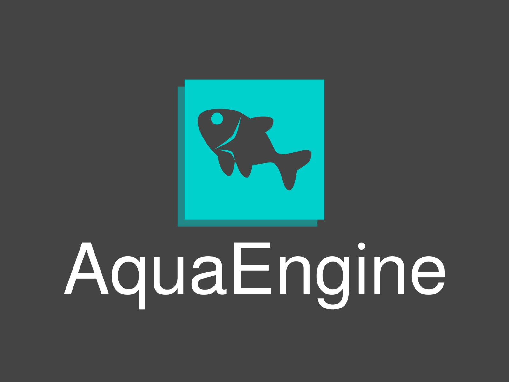| Siemens | SAP |
|-|-|-|-|-|
| Análisis SWOT | Fortalezas | Integración de procesos Optimización del inventario, Monitoreo continuo | Diversificación, Innovación, Fuerte Marca y Reputación | Lider en el mercado, Amplia Gama de Productos, Innovación Continua, Integración de Soluciones |
|| Debilidades   | Costo de implementación, Mantenimiento y soporte | Estructura compleja, Dependencias de Mercados Internacionales, Costos Elevados | Costos elevados, Complejidad de Implementación, Dependencia del Software Legacy | 
|| Oportunidades | Expansión del mercado, Innovación tecnológica, Demanda creciente, Alianzas estratégicas | Creciemiento en Energía Renovables, Expansión en Mercados Emergentes, Alianzas Estretegicas | Crecimiento en la Nube, Expansión en Mercados Emergentes, Innovación en IA y Analítica | 
|| Amenazas      | Competencia, Factores economicos, Regulaciones | Competencia intensa, Inestabilidad Global, Regulaciones y Normativas | Competencia intensa, Cambios en la Regulación, Evolución Rápida de la Tecnología |

## 2.2. Entrevistas.
### 2.2.1. Diseño de entrevistas.  
**Preguntas generales:**

1. ¿Cuál es su nombre? 
2. ¿Qué edad tiene? 
3. ¿Cuál es su ocupación? 
4. ¿En que sector trabajas (empresas de maquinaria/pescadores)? 
5. ¿Cuánto tiempo llevas en esta industria?  

**Entrevistas para el Segmento 1**
1. ¿Cómo gestionan actualmente la aceptación de pedidos y el inventario de componentes?
2. ¿Qué tan precisos y actualizados suelen estar sus inventarios de componentes?
3. ¿Cuánto tiempo y recursos destinan al monitoreo de equipos vendidos?
4. ¿Cómo gestionan la facturación por la venta de maquinaria y qué tan eficiente es este proceso?
5. ¿Qué mejoras específicas desearían ver en un sistema de gestión de producción?
6. ¿Qué problemas han surgido en la gestión de inventario y cómo los han resuelto?

**Entrevistas usuario segmento 2**
1. ¿Cómo llenan actualmente los datos relacionados con la pesca y el equipo utilizado? 
2. ¿Con qué frecuencia monitorean el estado de sus equipos de pesca?
3. ¿Qué problemas han tenido en la comunicación con las empresas de maquinaria respecto a pedidos y mantenimiento de equipos?
4. ¿Qué tan fácil es para ustedes realizar pedidos de componentes o maquinaria nueva?
5. ¿Cómo prefieren recibir actualizaciones o alertas sobre el estado de sus equipos?
6. ¿Qué factores consideran más importantes al decidir comprar maquinaria de una empresa específica?

### 2.2.2. Registro de entrevistas.

**Entrevista 1**
Nombre: Gabriela Bueno
Edad: 23 años 
Ocupación: Estudiante  
  
Url: https://upcedupe-my.sharepoint.com/:v:/g/personal/u202211212_upc_edu_pe/EZwrIjs6eCpGoXGtIJDmEhoBF9R8IPjJyn-Pjs6LYvVhmw?e=Se64nT

Gabriela Bueno, ex trabajadora de Fishman, mencionó que los clientes suelen pedir productos desde un catálogo, principalmente máquinas centrífugas que la empresa importa y luego instala y mantiene. Afirmó que el inventario está actualizado y que los mantenimientos se llevan a cabo fuera de la temporada de pesca, ya que es cuando las máquinas no están en uso. Sobre la facturación, Gabriela coincidió en que es un proceso eficiente y digital. Finalmente, sugirió que el sistema de inventario podría mejorarse agregando imágenes de los productos, destacando la importancia de este aspecto para una mejor gestión. Utiliza telefono iphone y una laptop con macOS.Además de usar chrome como navegador predeterminado


**Entrevista 2**

Nombre: Miguel del Castillo
Edad: 57 años 
Ocupación: Empresario 
  
Url: https://upcedupe-my.sharepoint.com/:v:/g/personal/u202211212_upc_edu_pe/EfsS8gIoxNRAnKKAcgRXfAgBT7SKASxxGqWHldWJSMPrQQ?e=n7SgSb&nav=eyJyZWZlcnJhbEluZm8iOnsicmVmZXJyYWxBcHAiOiJTdHJlYW1XZWJBcHAiLCJyZWZlcnJhbFZpZXciOiJTaGFyZURpYWxvZy1MaW5rIiwicmVmZXJyYWxBcHBQbGF0Zm9ybSI6IldlYiIsInJlZmVycmFsTW9kZSI6InZpZXcifX0%3D

Miguel del Castillo, un empresario del sector pesquero, comentó que los pedidos se gestionan a través de visitas a la planta del cliente, tras lo cual se desarrolla un proyecto que incluye el equipo solicitado. Luego, se procede con la orden de compra y el adelanto para iniciar los trabajos. Su empresa utiliza un sistema de inventario que está actualizado permanentemente para gestionar componentes y repuestos. Sin embargo, mencionó que han tenido problemas con el software de inventario en el pasado. Sobre el monitoreo de equipos, explicó que se realiza durante la temporada de veda. Finalmente, Miguel afirmó que la facturación se gestiona digitalmente de manera eficiente.Usa laptop, computadoras de escritorio (fijas) y celular para realizar sus actividades laborales, destacando que estos dispositivos son esenciales en su trabajo diario.


**Entrevistas usuario segmento 2**
1. 

### 2.2.3. Análisis de entrevistas.
**Segmento 1:**
{texto}
**Segmento 2:**
{texto}
## 2.3. Needfinding.
### 2.3.1. User Personas.
En esta sección, se incluyen las fichas de User Personas que representan arquetipos detallados de los segmentos objetivo definidos para nuestro sitio web. Estos arquetipos se han creado a partir de un análisis de las entrevistas que hemos realizado con usuarios reales y un estudio comparativo de la competencia, con el objetivo de capturar las caracterí­sticas, necesidades, y comportamientos de nuestros usuarios.

**Segmento 1:**  


**Segmento 2:**


### 2.3.2. User Task Matrix.
En esta sección, se presenta el User Task Matrix, que agrupa las principales tareas que los User Personas realizan para cumplir sus objetivos. Los segmentos considerados para este análisis son "Ricardo Salas," un dueño de una pequeña empresa especializada en la produccion de maquinaria para el sector pesquero, y "Carlos Martinez," un empresario nuevo en el sector pesquero. Las siguientes tareas identificadas reflejan las actividades esenciales que estos usuarios realizan independientemente de la existencia de nuestra aplicación web.

|  |  | Segmento 1  | Ricardo Salas | Segmento 2  | Carlos Martinez |
| --- | ------ | ----------- | ------------ | ----------- | ---------- |
| ID  | Titulo | Importancia | Frecuencia   | Importancia | Frecuencia |
| US01 | Registro de un nuevo usuario| Alta | Alta | Media | Baja |
| US02 | Inicio de Sesión | Alta | Media | Alta | Media |
| US03 | Estado de equipos | Alta | Media | Baja | Baja |
| US04 | Notificaciones de estado | Media | Alta | Media | Media |
| US05 | Historial de mantenimiento | Alta | Alta | Media | Baja |
| US06 | Alertas de equipos críticos | Alta | Media | Baja | Baja |
| US07 | Generación de facturas | Media | Media | Baja | Media |
| US08 | Personalizacion de plantillas | Baja | Baja | Alta | Alta |
| US09 | Historial de facturación | Alta | Media | Alta | Media |
| US10 | Notificaciones de estado | Media | Alta | Media | Media | 
| US11 | Gestion de inventario | Alta | Media | Media | Baja |
| US12 | Gestion de inventario | Alta | Media | Media | Baja |
| US13 | Consulta de productos en inventario | Media | Baja | Alta | Alta |
| US14 | Solicitud de compra de equipo estandar | Alta | Media | Alta | Media |
| US15 | Solicitud de alquiler de equipos | Alta | Alta | Media | Baja |
| US16 | Seguimiento de solicitudes de equipos | Media | Alta | Media | Alta |
| US17 | Cancelación de solicitudes de equipos | Media | Baja | Alta | Alta |
| US18 | Navegación por la Landing Page | Media | Media | Alta | Media |
| US19 | Visualización de Precios | Baja | Baja | Alta | Alta |
| US20 | Comparación de beneficios | Baja | Baja | Media | Media | 
| US21 | Contacto con ventas desde la landing page | Media | Baja | Alta | Media |
| US22 | Consulta de reseñas de clientes | Baja | Baja | Media | Media
### 2.3.3. User Journey Mapping.
En esta sección se presentan los User Journey Maps, que ilustran el end-to-end journey que experimentan nuestros segmentos objetivo sin la intervención de nuestra solución propuesta. En estos mapas se identifican las etapas, interacciones y puntos de contacto que atraviesan para cumplir sus objetivos educativos. Por un lado, se presenta el recorrido completo que sigue el dueño, Ricardo Salas, al proponer un proyecto especial para el sector pesquero. Por otro lado, se detalla el recorrido del nuevo empresario, Carlos Martinez, al buscar materiales o productos para dicho proyecto asignado.

**Segmento 1**
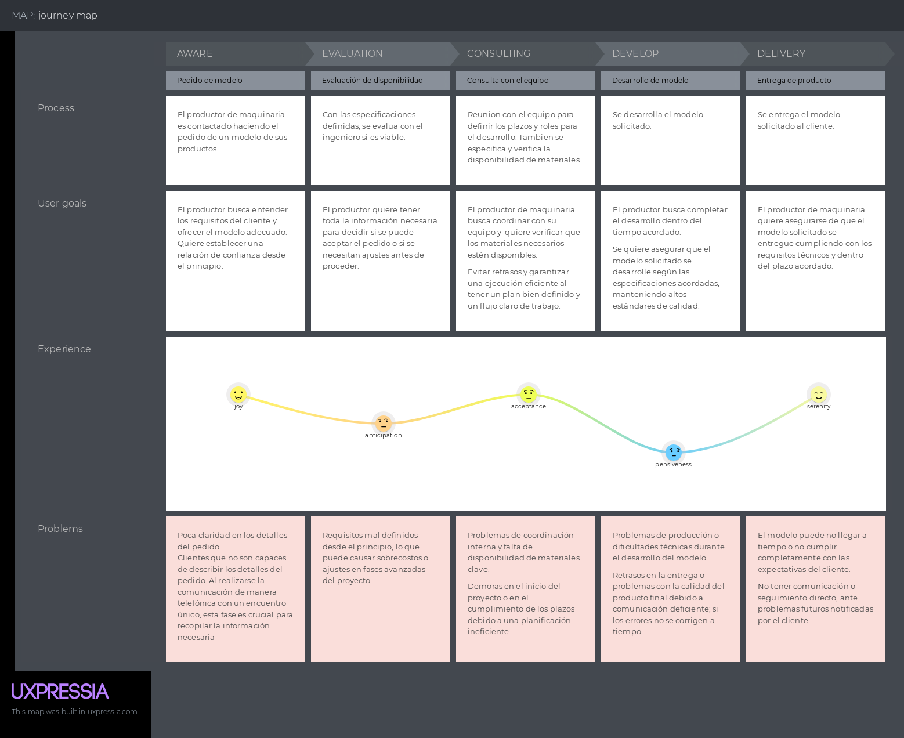

**Segmento 2**


### 2.3.4. Empathy Mapping.
Para los Empathy Mapping, esta herramienta nos ayudará a conocer un poco más lo que los usuarios sienten o necesitan de nuestra aplicación. Para llevarlo a cabo, se usará a las User Personas, los cuales son "Ricardo Salas", quien es el dueño de una pequeña empresa especializada en la produccion de maquinarias. El segundo es "Carlos Martinez", quien es un empresario nuevo que tiene ganas de competir en el mercado, pero debera optimizar tanto la comunicacion entre los proovedores con el mantenimiento de sus herramientas y maquinaria.

**Segmento 1:**


**Segmento 2:**


### 2.3.5. As-is Scenario Mapping.
Para los As-Is Scenario, es una herramienta que nos ayuda a ejemplificar de mejor manera cual es el escenario actual sobre el problema que se intentará resolver, en este caso lo que son las clases en línea, presentando para nuestro proyecto el problema al momento del fabricante de maquinaria pesquera.

**Segmento 1**  


**Segmento 2**  


## 2.4. Ubiquitous Language.
```
Texto ubiquo: Definicion de este
```

---

# Capítulo III: Requirements Specification
## 3.1. To-Be Scenario Mapping.


Segmento 1: Productor de maquinaria pesquera

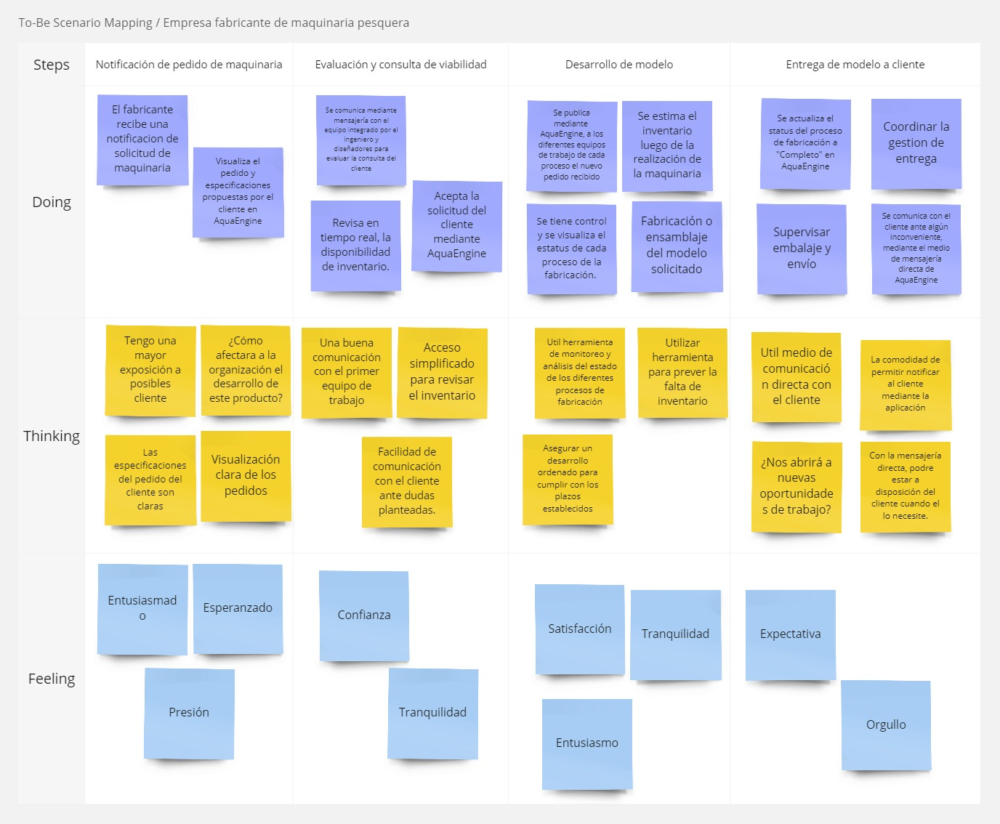

Segmento 2: Empresa pesquera

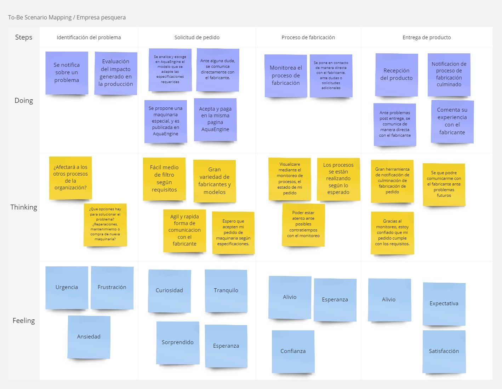

## 3.2. User Stories.
En esta sección, estructuraremos nuestro proceso de desarrollo y aseguraremos de cubrir los aspectos necesarios para satisfacer las necesidades del usuario.

A continuación, estableceremos las epicas, para luego detallarlas en historias de usuario. De este modo estableceremos los objetivos y funcionalidades.
| EPIC/ USER STORY ID | Titulo | Descripción | Criterio de aceptación |Relacionado a la epica #|
|-|-|-|-|-|
| E01 | Registro |Como empresario pesquero o productor de maquinaria, Quiero poder registrarme o iniciar sesión para acceder a las funciones asignadas a mi rol. | | |
| E02 | Monitoreo de equipos| Como empresario pesquero, Quiero poder verificar el estado de mis equipos a través de la aplicación web | | |
| E03 | Facturación  | Como productor de maquinaria pesquera, Quiero realizar mi facturación de manera más rápida. | | |
| E04 | Inventario | Como productor de maquinaria pesquera deseo tener un inventario al que  | | |
| E05 | Solicitudes de Equipos | Como empresario pesquero, quiero poder realizar solicitudes de compra de equipos a la empresa productora para que me brinden el equipo necesario. | | |
| E06 | Landing Page y Precios | Como usuario potencial,<br> Quiero navegar por una Landing Page Informativa<br> Para poder informarme sobre los beneficios y costos de un producto | | |
|E07|Gestión del inventario|Como desarrollador, <br> Quiero desarrollar y mantener endpoints de API para gestionar el inventario de los productores de maquinaria, <br> Para permitir la gestion de inventario a traves de la aplicacion web|||
| E08 | Gestión de maquinaria pesquera | Como desarrollador,<br> Quiero desarrollar y mantener endpoints de API para gestionar el catálogo de productos hechos por los productores de maquinaria,<br> Para permitir la visualización, creación, actualización y eliminación de productos en la aplicación web. | | |
| E09 | Gestión de usuarios | Como desarrollador,<br> Quiero desarrollar y mantener endpoints de API para la gestión de usuarios,<br> Para permitir el registro, inicio de sesión, actualización y eliminación de cuentas de usuarios dentro de la aplicación web. | | |
| E10 | Gestión de precios | Como desarrollador,<br> Quiero desarrollar y mantener endpoints de API para gestionar la facturación de los productos y servicios ofrecidos por los productores de maquinaria,<br> Para permitir la creación, consulta y administración de facturas a través de la aplicación web. | | |
| US01                | Registro de un nuevo usuario  | **Como** empresario pesquero o productor de maquinaria <br>**Quiero** registrar una cuenta en la aplicación <br> **Para** acceder a las funciones asignadas a mi rol. | **Escenario 1: Registro exitoso del usuario** <br><br>Dado que el usuario ingresa la información requerida y cuenta con un correo no registrado en el sistema <br>Cuando el usuario envía el formulario de registro <br> Entonces el usuario recibe una confirmación de registro y puede iniciar sesión. <br><br>**Escenario 2: Registro fallido por usuario ya existente** <br><br>Dado que el usuario intenta registrar un email que ya está en uso <br>Cuando el usuario envía el formulario de registro <br> Entonces el sistema muestra un mensaje indicando que el email ya está registrado y solicita usar uno diferente. | E01                      |
| US02                | Inicio de sesión              | **Como** empresario pesquero o productor de maquinaria <br>**Quiero**  poder iniciar sesión en la aplicación <br> **Para** acceder a las funciones habilitadas para mi cuenta. | **Escenario 1: Inicio de sesión exitoso** <br><br>Dado que el usuario se encuentra registrado en el sistema y se encuentra en la página de inicio de sesión <br>Cuando el usuario envía el formulario de inicio de sesión <br> Entonces el usuario es redirigido a su panel de control especifico con las funcionalidades especificas asignadas a su sector sujeto a su plan de suscripción. <br><br>**Escenario 2: Error en el inicio de sesión por credenciales incorrectas** <br><br>Dado que el usuario ingresa credenciales incorrectas o no registradas <br>Cuando el usuario envía el formulario de inicio de sesión <br> Entonces el sistema muestra un mensaje de error indicando que las credenciales son incorrectas y permite al usuario intentar de nuevo. | E01                      |
| US03                | Estado de equipos              | **Como** empresario pesquero <br>**Quiero** verificar el estado actual de mis equipos <br> **Para** saber si están operativos o necesitan mantenimiento. | **Escenario 1: Visualización del estado de equipos** <br><br>Dado que el usuario accede a la sección de monitoreo de equipos <br>Cuando el usuario consulta el listado de equipos asignados a su cuenta<br> Entonces se mostrará una relación de los equipos, mostrando así sus estados(operativo, en mantenimiento, etc.). | E02  |
| US04                | Registro de equipos      | **Como** empresario pesquero <br>**Quiero** poder añadir equipos a mi cuenta <br> **Para** mantener un monitoreo de los equipos recientes para evitar estados críticos. | **Escenario 1: Creación exitosa de un nuevo equipo** <br><br>Dado que el usuario está en la sección de estado de equipos <br>Cuando selecciona "nuevo equipo" <br> Entonces el sistema abrirá una interfaz de usuario para que este pueda añadir su nuevo equipo **Escenario 2:** | E02                      |
| US05             | Historial de mantenimiento     | **Como** empresario pesquero <br>**Quiero** consultar el historial de mantenimiento de mis equipos <br> **Para** revisar las actividades realizadas. | **Escenario 1: Consulta de historial de mantenimiento** <br><br>Dado que el usuario selecciona un equipo <br>Cuando el usuario haga click sobre el botón para consultar el historial <br> Entonces el sistema mostrará historial de mantenimiento se muestra con todas las actividades realizadas. <br><br>**Escenario 2: Historial vacío o no disponible** <br><br>Dado que el usuario consulta el historial de un equipo registrado <br>Cuando el usuario seleccione ver más información <br> Entonces el sistema muestra un mensaje indicando que no hay historial disponible para ese equipo. | E02                      |
| US06                | Alertas de equipos críticos    | **Como** empresario pesquero <br>**Quiero** establecer alertas para el estado crítico de mis equipos <br> **Para** recibir notificaciones cuando un equipo necesite atención urgente. | **Escenario 1: Configuración de alertas** <br><br>Dado que el usuario active las notificaciones de un dispositivo <br>Cuando el equipo se encuentre en un estado diferente afuncional <br> Entonces el sistema mostrará una notificación sobre el error. | E02                      |
| US07                | Generación de facturas         | **Como** productor de maquinaria pesquera <br>**Quiero** generar facturas automáticamente <br> **Para** acelerar el proceso de facturación. | **Escenario 1: Generación de factura** <br><br>Dado que el usuario realiza una venta <br>Cuando el usuario ingresa los datos de la factura en el sistema <br> Entonces el sistema almacena los datos proporcionados para una posterior visualización. <br><br>**Escenario 2: Error en la generación de factura** <br><br>Dado que el usuario ingresa datos incompletos o incorrectos <br>Cuando el usuario intenta generar la factura <br> Entonces el sistema muestra un mensaje de error indicando qué datos son inválidos o faltantes y permite corregir los datos.| E03                      |
| US08                | Historial de facturación       | **Como** productor de maquinaria pesquera <br>**Quiero** consultar el historial de todas mis facturas <br> **Para** llevar un registro completo de las transacciones. | **Escenario 1: Consulta de historial de facturación** <br><br>Dado que el usuario accede al historial de facturación <br>Cuando el usuario aplica filtros (por fecha, cliente, etc.) <br> Entonces el historial se muestra con las facturas correspondientes. <br><br>**Escenario 2: Historial vacío o incompleto** <br><br>Dado que el usuario consulta el historial <br>Cuando no hay facturas registradas o el historial está incompleto <br> Entonces el sistema muestra un mensaje indicando que no hay facturas disponibles y permite al usuario ajustar los filtros de búsqueda. <br><br>**Escenario 3: Problemas en la carga del historial** <br><br>Dado que el usuario intenta acceder al historial <br>Cuando el sistema experimenta problemas de carga <br> Entonces el sistema muestra un mensaje de error y sugiere al usuario intentar más tarde.|E03                      |
| US09  | Notificaciones de estado | **Como** empresario pesquero <br>**Quiero** recibir notificaciones sobre el estado de mis equipos <br> **Para** estar informado sobre cualquier cambio crítico. | **Escenario 1: Recepción de notificaciones** <br><br>Dado que el estado de un equipo cambia a crítico <br>Cuando el sistema detecta el cambio <br> Entonces el usuario recibe una notificación por dentro de la aplicación. <br><br>**Escenario 2: Falta de notificación por cambio crítico** <br><br>Dado que el estado de un equipo cambia a crítico <br>Cuando el usuario no recibe una notificación <br> Entonces el sistema muestra un mensaje indicando un fallo en su funcionamiento. |E02|
| US10                | Gestión de inventario          | **Como** productor de maquinaria pesquera <br>**Quiero** gestionar el inventario de mis productos <br> **Para** saber qué productos están disponibles para la venta. | **Escenario 1: Gestión exitosa del inventario** <br><br>Dado que el usuario ingresa al sistema de inventario <br>Cuando el usuario realice un cambio en su inventario <br> Entonces el sistema guarda los cambios y muestra el inventario actualizado a todos los trabajadores que tengan autorización a esa información. <br><br>**Escenario 2: Error en la actualización del inventario** <br><br>Dado que el usuario intenta actualizar el inventario <br>Cuando la información enviada en el formulario sea incompleta <br> Entonces el sistema muestra un mensaje de error y no procede la operación. | E04                      |
| US11                | Consulta de productos en inventario | **Como** productor de maquinaria pesquera <br>**Quiero** consultar el inventario actual de productos <br> **Para** planificar mis próximas ventas. | **Escenario 1: Consulta exitosa del inventario** <br><br>Dado que el usuario accede al sistema de inventario <br>Cuando el usuario selecciona la categoría de productos previamente fabricados <br> Entonces se muestran todos los productos disponibles  correspondiente a la búsqueda y sus cantidades actualizadas. <br><br>**Escenario 2: Error en la consulta del inventario** <br><br>Dado que el usuario accede al sistema de inventario <br>Cuando el usuario ingrese información no existente en la búsqueda<br> Entonces el sistema muestra un mensaje de error e indica que no hay coincidencias. | E04                      |
| US12 | Solicitud de compra de equipo estándar | Como empresario pesquero, quiero poder seleccionar un equipo estándar y realizar la compra a través de la plataforma, para asegurarme de tener el equipo que necesito rápidamente. | **Escenario 1: Solicitud de compra enviada exitosamente**<br>Dado que el usuario accede a la opción de pedidos,<br>Cuando selecciona un equipo estándar y completa el formulario de compra,<br>Entonces el sistema confirma la solicitud y el usuario recibe una notificación de compra exitosa.<br><br>**Escenario 2: Error en la solicitud de compra**<br>Dado que el usuario intenta completar la solicitud de compra,<br>Cuando hay un error en el envío del formulario,<br>Entonces el sistema muestra un mensaje de error y solicita al usuario que lo intente nuevamente. | E05 |
| US13 | Solicitud de compra de equipo personalizado | Como empresario pesquero, quiero poder realizar una solicitud de compra de equipos personalizados, para obtener un equipo adaptado a las necesidades de mi operación. | **Escenario 1: Solicitud de equipo personalizado realizada con éxito**<br>Dado que el usuario accede a la sección de equipos personalizados,<br>Cuando completa el formulario con las especificaciones técnicas del equipo,<br>Entonces el sistema envía la solicitud al proveedor, y el usuario recibe una confirmación del pedido siendo procesado correctamente.<br><br>**Escenario 2: Error en la solicitud de equipo personalizado**<br>Dado que el usuario intenta enviar una solicitud personalizada,<br>Cuando el usuario envie información incompleta o erronea en el formulario<br>Entonces el sistema muestra un mensaje de error e informa al usuario sobre los campos incompletos o imposibles de realizar. | E05 |
| US14 | Seguimiento de solicitudes de equipos | Como empresario pesquero, quiero poder hacer seguimiento del estado de mis pedidos, para saber cuándo recibiré los equipos solicitados. | **Escenario 1: Seguimiento exitoso de la solicitud**<br>Dado que el usuario ha realizado una solicitud de compra o alquiler<br>Cuando accede a la sección "Mis Solicitudes",<br>Entonces el sistema mostará el estado actual(En proceso, Aprobada, En camino, etc.) de cada solicitud.<br><br>**Escenario 2: Seguimiento fallido por falta de pedidos**<br>Dado que el usuario intenta consultar el estado de una solicitud,<br>Cuando no haya pedidos por el momento<br>Entonces el sistema muestra un mensaje indicando que no se puede obtener el estado de la solicitud debido a la inexistencia del mismo. | E05 |
| US15 | Cancelación de solicitudes de equipos | Como empresario pesquero, quiero poder cancelar una solicitud de pedidos, para adaptarme a cambios en mis operaciones. | **Escenario 1: Cancelación de solicitud exitosa**<br>Dado que el usuario ha realizado una solicitud y desea cancelarla,<br>Cuando accede a la opción de cancelar antes del envío del equipo,<br>Entonces el sistema confirma la cancelación y el usuario recibe una confirmación sobre la cancelación.<br><br>**Escenario 2: Error en la cancelación de la solicitud**<br>Dado que el usuario intenta cancelar una solicitud,<br>Cuando el equipo ya ha sido enviado <br>Entonces el sistema muestra un mensaje indicando que no es posible cancelar la solicitud. | E05 |
| US16 | Navegación por la Landing Page | Como usuario potencial, quiero poder navegar fácilmente por la landing page, para obtener información clara y precisa sobre AquaEngine. | **Escenario 1: Navegación exitosa**<br> Dado que el usuario accede a la landing page,<br> Cuando navega por las diferentes secciones,<br> Entonces la página muestra elementos clave como los precios y contacto.  | E06 |
| US17 | Visualización de Precios | Como usuario potencial, quiero ver claramente los precios de los productos ofrecidos en la landing page, para evaluar si se ajustan a mi presupuesto. | **Escenario 1: Precios visibles en la página**<br> Dado que el usuario está en la landing page,<br> Cuando accede a la sección de precios,<br> Entonces los precios se muestran claramente y sin problemas. | E06 |
| US18 | Comparación de beneficios | Como usuario potencial, quiero comparar los beneficios de diferentes planes en la landing page, para decidir cuál es la mejor opción para mí. | **Escenario 1: Comparación exitosa**<br> Dado que el usuario accede a la landing page,<br> Cuando compara planes del productos,<br> Entonces puede ver una comparativa clara con los beneficios de cada producto.| E06 |
| US19 | Contacto con ventas desde la landing page | Como usuario potencial, quiero poder contactar al equipo de ventas directamente desde la landing page, para obtener más información sobre los productos o servicios. | **Escenario 1: Contacto exitoso**<br> Dado que el usuario accede a la landing page,<br> Cuando selecciona la opción de contacto y completa el formulario de contacto,<br> Entonces el sistema envía la solicitud correctamente. | E06 |
| US20 | Consulta de reseñas de clientes | Como usuario potencial, quiero ver reseñas de clientes en la landing page, para conocer la experiencia de otros usuarios con el producto. | **Escenario 1: Visualización exitosa de reseñas**<br> Dado que el usuario accede a la landing page,<br> Cuando accede a la sección de reseñas,<br> Entonces puede ver las reseñas de otros clientes sin problemas. | E06 |
| TS01 | Crear Registro de Inventario | Como desarrollador,<br> Quiero implementar el endpoint POST para crear registros de inventario,<br> Para permitir a los productores de maquinaria agregar nuevos productos a su inventario. | Escenario 1: Creación exitosa de un registro de inventario<br> Dado que el endpoint /api/v1/inventory está disponible,<br> Cuando se envía una solicitud POST con valores para productId y cantidad,<br> Entonces se recibe una respuesta con estado 201,<br> Y el recurso de Inventario está incluido en el cuerpo de la respuesta, con un nuevo ID y los valores registrados para productId y cantidad.<br><br>Escenario 2: Creación duplicada de un registro de inventario<br> Dado que el endpoint /api/v1/inventory está disponible,<br> Cuando se envía una solicitud POST con valores que ya existen para productId,<br> Entonces se recibe una respuesta con estado 400,<br> Y se incluye un mensaje en el cuerpo de la respuesta, con el valor "No se cumplen todas las restricciones para el inventario: Ya existe un registro de inventario para este producto." | E07 |
| TS02 | Leer Registro de Inventario | Como desarrollador,<br> Quiero implementar el endpoint GET para leer registros de inventario,<br> Para permitir a los usuarios recuperar los detalles de los elementos del inventario. | Escenario 1: Recuperación exitosa de un registro de inventario<br> Dado que el endpoint /api/v1/inventory/{id} está disponible,<br> Cuando se envía una solicitud GET con un id válido,<br> Entonces se recibe una respuesta con estado 200,<br> Y el recurso de Inventario está incluido en el cuerpo de la respuesta con los detalles del id especificado.<br><br>Escenario 2: Recuperación de un registro de inventario inexistente<br> Dado que el endpoint /api/v1/inventory/{id} está disponible,<br> Cuando se envía una solicitud GET con un id inválido,<br> Entonces se recibe una respuesta con estado 404,<br> Y se incluye un mensaje en el cuerpo de la respuesta, con el valor "Registro de inventario no encontrado." | E07 |
| TS03 | Actualizar Registro de Inventario | Como desarrollador,<br> Quiero implementar el endpoint PUT para actualizar registros de inventario,<br> Para permitir a los usuarios modificar detalles existentes del inventario. | Escenario 1: Actualización exitosa de un registro de inventario<br> Dado que el endpoint /api/v1/inventory/{id} está disponible,<br> Cuando se envía una solicitud PUT con el id y los valores actualizados para productId y cantidad,<br> Entonces se recibe una respuesta con estado 200,<br> Y el recurso de Inventario actualizado está incluido en el cuerpo de la respuesta con los nuevos valores para productId y cantidad.<br><br>Escenario 2: Actualización de un registro de inventario inexistente<br> Dado que el endpoint /api/v1/inventory/{id} está disponible,<br> Cuando se envía una solicitud PUT con un id inválido y valores actualizados,<br> Entonces se recibe una respuesta con estado 404,<br> Y se incluye un mensaje en el cuerpo de la respuesta, con el valor "Registro de inventario no encontrado para actualizar." | E07 |
| TS04 | Eliminar Registro de Inventario | Como desarrollador,<br> Quiero implementar el endpoint DELETE para eliminar registros de inventario,<br> Para permitir a los usuarios eliminar elementos del inventario de sus registros. | Escenario 1: Eliminación exitosa de un registro de inventario<br> Dado que el endpoint /api/v1/inventory/{id} está disponible,<br> Cuando se envía una solicitud DELETE con un id válido,<br> Entonces se recibe una respuesta con estado 200,<br> Y se incluye un mensaje en el cuerpo de la respuesta, con el valor "Registro de inventario eliminado con éxito.".<br><br>Escenario 2: Eliminación de un registro de inventario inexistente<br> Dado que el endpoint /api/v1/inventory/{id} está disponible,<br> Cuando se envía una solicitud DELETE con un id inválido,<br> Entonces se recibe una respuesta con estado 404,<br> Y se incluye un mensaje en el cuerpo de la respuesta, con el valor "Registro de inventario no encontrado para eliminar." | E07 |
| TS05 | Crear Registro de Maquinaria de Pesca | Como desarrollador,<br> Quiero implementar el endpoint POST para crear registros de maquinaria de pesca,<br> Para permitir a los productores de maquinaria agregar nueva maquinaria de pesca a su inventario. | Escenario 1: Creación exitosa de un registro de maquinaria de pesca<br> Dado que el endpoint /api/v1/fishing-machinery está disponible,<br> Cuando se envía una solicitud POST con valores para equipmentId y cantidad,<br> Entonces se recibe una respuesta con estado 201,<br> Y el recurso de Maquinaria de Pesca está incluido en el cuerpo de la respuesta, con un nuevo ID y los valores registrados para equipmentId y cantidad.<br><br>Escenario 2: Creación duplicada de un registro de maquinaria de pesca<br> Dado que el endpoint /api/v1/fishing-machinery está disponible,<br> Cuando se envía una solicitud POST con valores que ya existen para equipmentId,<br> Entonces se recibe una respuesta con estado 400,<br> Y se incluye un mensaje en el cuerpo de la respuesta, con el valor "No se cumplen todas las restricciones para Maquinaria de Pesca: Ya existe un registro de maquinaria para este ID." | E08 |
| TS06 | Leer Registro de Maquinaria de Pesca | Como desarrollador,<br> Quiero implementar el endpoint GET para leer registros de maquinaria de pesca,<br> Para permitir a los usuarios recuperar los detalles de los elementos de maquinaria de pesca. | Escenario 1: Recuperación exitosa de un registro de maquinaria de pesca<br> Dado que el endpoint /api/v1/fishing-machinery/{id} está disponible,<br> Cuando se envía una solicitud GET con un id válido,<br> Entonces se recibe una respuesta con estado 200,<br> Y el recurso de Maquinaria de Pesca está incluido en el cuerpo de la respuesta con los detalles del id especificado.<br><br>Escenario 2: Recuperación de un registro de maquinaria de pesca inexistente<br> Dado que el endpoint /api/v1/fishing-machinery/{id} está disponible,<br> Cuando se envía una solicitud GET con un id inválido,<br> Entonces se recibe una respuesta con estado 404,<br> Y se incluye un mensaje en el cuerpo de la respuesta, con el valor "Registro de maquinaria de pesca no encontrado." | E08 |
| TS07 | Actualizar Registro de Maquinaria de Pesca | Como desarrollador,<br> Quiero implementar el endpoint PUT para actualizar registros de maquinaria de pesca,<br> Para permitir a los usuarios modificar detalles existentes de la maquinaria de pesca. | Escenario 1: Actualización exitosa de un registro de maquinaria de pesca<br> Dado que el endpoint /api/v1/fishing-machinery/{id} está disponible,<br> Cuando se envía una solicitud PUT con el id y los valores actualizados para equipmentId y cantidad,<br> Entonces se recibe una respuesta con estado 200,<br> Y el recurso de Maquinaria de Pesca actualizado está incluido en el cuerpo de la respuesta con los nuevos valores para equipmentId y cantidad.<br><br>Escenario 2: Actualización de un registro de maquinaria de pesca inexistente<br> Dado que el endpoint /api/v1/fishing-machinery/{id} está disponible,<br> Cuando se envía una solicitud PUT con un id inválido y valores actualizados,<br> Entonces se recibe una respuesta con estado 404,<br> Y se incluye un mensaje en el cuerpo de la respuesta, con el valor "Registro de maquinaria de pesca no encontrado para actualizar." | E08 |
| TS08 | Eliminar Registro de Maquinaria de Pesca | Como desarrollador,<br> Quiero implementar el endpoint DELETE para eliminar registros de maquinaria de pesca,<br> Para permitir a los usuarios eliminar maquinaria de pesca de sus registros. | Escenario 1: Eliminación exitosa de un registro de maquinaria de pesca<br> Dado que el endpoint /api/v1/fishing-machinery/{id} está disponible,<br> Cuando se envía una solicitud DELETE con un id válido,<br> Entonces se recibe una respuesta con estado 200,<br> Y se incluye un mensaje en el cuerpo de la respuesta, con el valor "Registro de maquinaria de pesca eliminado con éxito.".<br><br>Escenario 2: Eliminación de un registro de maquinaria de pesca inexistente<br> Dado que el endpoint /api/v1/fishing-machinery/{id} está disponible,<br> Cuando se envía una solicitud DELETE con un id inválido,<br> Entonces se recibe una respuesta con estado 404,<br> Y se incluye un mensaje en el cuerpo de la respuesta, con el valor "Registro de maquinaria de pesca no encontrado para eliminar." | E08 |
| TS09 | Crear Registro de Usuario | Como desarrollador,<br> Quiero implementar el endpoint POST para crear registros de usuario,<br> Para permitir a los administradores agregar nuevos usuarios al sistema. | Escenario 1: Creación exitosa de un registro de usuario<br> Dado que el endpoint /api/v1/user está disponible,<br> Cuando se envía una solicitud POST con valores para userId, username y role,<br> Entonces se recibe una respuesta con estado 201,<br> Y el recurso de Usuario está incluido en el cuerpo de la respuesta, con un nuevo ID y los valores registrados para userId, username y role.<br><br>Escenario 2: Creación duplicada de un registro de usuario<br> Dado que el endpoint /api/v1/user está disponible,<br> Cuando se envía una solicitud POST con valores que ya existen para userId,<br> Entonces se recibe una respuesta con estado 400,<br> Y se incluye un mensaje en el cuerpo de la respuesta, con el valor "No se cumplen todas las restricciones para el usuario: Ya existe un registro de usuario para este ID." | E09 |
| TS10 | Leer Registro de Usuario | Como desarrollador,<br> Quiero implementar el endpoint GET para leer registros de usuario,<br> Para permitir a los administradores recuperar los detalles de los usuarios. | Escenario 1: Recuperación exitosa de un registro de usuario<br> Dado que el endpoint /api/v1/user/{id} está disponible,<br> Cuando se envía una solicitud GET con un id válido,<br> Entonces se recibe una respuesta con estado 200,<br> Y el recurso de Usuario está incluido en el cuerpo de la respuesta con los detalles del id especificado.<br><br>Escenario 2: Recuperación de un registro de usuario inexistente<br> Dado que el endpoint /api/v1/user/{id} está disponible,<br> Cuando se envía una solicitud GET con un id inválido,<br> Entonces se recibe una respuesta con estado 404,<br> Y se incluye un mensaje en el cuerpo de la respuesta, con el valor "Registro de usuario no encontrado." | E09 |
| TS11 | Actualizar Registro de Usuario | Como desarrollador,<br> Quiero implementar el endpoint PUT para actualizar registros de usuario,<br> Para permitir a los administradores modificar los detalles de las cuentas de usuario existentes. | Escenario 1: Actualización exitosa de un registro de usuario<br> Dado que el endpoint /api/v1/users/{id} está disponible,<br> Cuando se envía una solicitud PUT con el id y valores actualizados para userId y userDetails,<br> Entonces se recibe una respuesta con estado 200,<br> Y el recurso de Usuario actualizado está incluido en el cuerpo de la respuesta con los nuevos valores para userId y userDetails.<br><br>Escenario 2: Actualización de un registro de usuario inexistente<br> Dado que el endpoint /api/v1/users/{id} está disponible,<br> Cuando se envía una solicitud PUT con un id inválido y valores actualizados,<br> Entonces se recibe una respuesta con estado 404,<br> Y se incluye un mensaje en el cuerpo de la respuesta, con el valor "Registro de usuario no encontrado para actualizar." | E09 |
| TS12 | Eliminar Registro de Usuario | Como desarrollador,<br> Quiero implementar el endpoint DELETE para eliminar registros de usuario,<br> Para permitir a los administradores eliminar cuentas de usuario del sistema. | Escenario 1: Eliminación exitosa de un registro de usuario<br> Dado que el endpoint /api/v1/users/{id} está disponible,<br> Cuando se envía una solicitud DELETE con un id válido,<br> Entonces se recibe una respuesta con estado 200,<br> Y se incluye un mensaje en el cuerpo de la respuesta, con el valor "Registro de usuario eliminado con éxito.".<br><br>Escenario 2: Eliminación de un registro de usuario inexistente<br> Dado que el endpoint /api/v1/users/{id} está disponible,<br> Cuando se envía una solicitud DELETE con un id inválido,<br> Entonces se recibe una respuesta con estado 404,<br> Y se incluye un mensaje en el cuerpo de la respuesta, con el valor "Registro de usuario no encontrado para eliminar." | E09 |
| TS13 | Crear Registro de Facturación | Como desarrollador,<br> Quiero implementar el endpoint POST para crear registros de facturación,<br> Para permitir a los usuarios generar nuevas entradas de facturación. | Escenario 1: Creación exitosa de un registro de facturación<br> Dado que el endpoint /api/v1/billing está disponible,<br> Cuando se envía una solicitud POST con valores para billingId y billingDetails,<br> Entonces se recibe una respuesta con estado 201,<br> Y el recurso de Facturación está incluido en el cuerpo de la respuesta, con un nuevo ID y los valores registrados para billingId y billingDetails.<br><br>Escenario 2: Creación duplicada de un registro de facturación<br> Dado que el endpoint /api/v1/billing está disponible,<br> Cuando se envía una solicitud POST con valores que ya existen para billingId,<br> Entonces se recibe una respuesta con estado 400,<br> Y se incluye un mensaje en el cuerpo de la respuesta, con el valor "No se cumplen todas las restricciones para Facturación: Ya existe un registro de facturación para este ID." | E10 |
| TS14 | Leer Registro de Facturación | Como desarrollador,<br> Quiero implementar el endpoint GET para leer registros de facturación,<br> Para permitir a los usuarios recuperar los detalles de sus entradas de facturación. | Escenario 1: Recuperación exitosa de un registro de facturación<br> Dado que el endpoint /api/v1/billing/{id} está disponible,<br> Cuando se envía una solicitud GET con un id válido,<br> Entonces se recibe una respuesta con estado 200,<br> Y el recurso de Facturación está incluido en el cuerpo de la respuesta con los detalles del id especificado.<br><br>Escenario 2: Recuperación de un registro de facturación inexistente<br> Dado que el endpoint /api/v1/billing/{id} está disponible,<br> Cuando se envía una solicitud GET con un id inválido,<br> Entonces se recibe una respuesta con estado 404,<br> Y se incluye un mensaje en el cuerpo de la respuesta, con el valor "Registro de facturación no encontrado." | E10 |
| TS15 | Actualizar Registro de Facturación | Como desarrollador,<br> Quiero implementar el endpoint PUT para actualizar registros de facturación,<br> Para permitir a los usuarios modificar detalles de facturación existentes. | Escenario 1: Actualización exitosa de un registro de facturación<br> Dado que el endpoint /api/v1/billing/{id} está disponible,<br> Cuando se envía una solicitud PUT con el id y valores actualizados para billingId y billingDetails,<br> Entonces se recibe una respuesta con estado 200,<br> Y el recurso de Facturación actualizado está incluido en el cuerpo de la respuesta con los nuevos valores para billingId y billingDetails.<br><br>Escenario 2: Actualización de un registro de facturación inexistente<br> Dado que el endpoint /api/v1/billing/{id} está disponible,<br> Cuando se envía una solicitud PUT con un id inválido y valores actualizados,<br> Entonces se recibe una respuesta con estado 404,<br> Y se incluye un mensaje en el cuerpo de la respuesta, con el valor "Registro de facturación no encontrado para actualizar." | E10 |
| TS16 | Eliminar Registro de Facturación | Como desarrollador,<br> Quiero implementar el endpoint DELETE para eliminar registros de facturación,<br> Para permitir a los usuarios eliminar entradas de facturación del sistema. | Escenario 1: Eliminación exitosa de un registro de facturación<br> Dado que el endpoint /api/v1/billing/{id} está disponible,<br> Cuando se envía una solicitud DELETE con un id válido,<br> Entonces se recibe una respuesta con estado 200,<br> Y se incluye un mensaje en el cuerpo de la respuesta, con el valor "Registro de facturación eliminado con éxito.".<br><br>Escenario 2: Eliminación de un registro de facturación inexistente<br> Dado que el endpoint /api/v1/billing/{id} está disponible,<br> Cuando se envía una solicitud DELETE con un id inválido,<br> Entonces se recibe una respuesta con estado 404,<br> Y se incluye un mensaje en el cuerpo de la respuesta, con el valor "Registro de facturación no encontrado para eliminar." | E10 |

## 3.3. Impact Mapping.

## 3.4. Product Backlog.

 En este segmento del informe otorgaremos a las historias de usuario un peso en base a la complejidad, riesgo y esfuerzo. Utilizaremos este método para darle la relevancia adecuada a cada historia de usuario.

https://trello.com/b/NknfxMfU/product-backlog

|#Orden| User Story Id| Titulo | Descripción|StoryPoints (1 / 2 / 3 / 5/ 8)|
|-|-|-|-|-|
|1|US16| Navegación por la LandingPage| Como usuario potencial, quiero poder navegar fácilmente por la landing page para obtener información clara y precisa sobre AquaEngine|3|
|2 |  US19 |Contacto con ventas desde la landing page |Como usuario potencial,quiero poder contactar al equipo de ventas directamente desde la landing page, para obtener más información sobre los productos o servicios.  | 3 |
|3 | US17 | Visualización de Precios |  Como usuario potencial, quiero ver claramente los precios de los productos ofrecidos en la landing page, para evaluar si se ajustan a mi presupuesto| 1|
|4 | US18| Comparación de beneficios |Como usuario potencial, quiero comparar los beneficios de diferentes planes en la landing page, para decidir cuál es la mejor opción para mí.         | 1  |
| 5| US12 | Solicitud de compra de equipo estándar|Como empresario pesquero, quiero poder seleccionar un equipo estándar y realizar la compra a través de la plataforma, para asegurarme de tener el equipo que necesito rápidamente.| 3       |
|6 | US10 | Gestión de inventario| Como productor de maquinaria pesquera  Quiero gestionar el inventario de mis productos  Para saber qué productos están disponibles para la venta.            |   5        |
|7 |US07 |Generación de facturas| Como productor de maquinaria pesquera  Quiero generar facturas automáticamente Para acelerar el proceso de facturación.  |    3     |
|8 |US03 |Estado de equipos | Como empresario pesquero Quiero verificar el estado actual de mis equipos  Para saber si están operativos o necesitan mantenimiento.|  3    |
| 9|US14 |Seguimiento de solicitudes de equipos | Como empresario pesquero, quiero poder hacer seguimiento del estado de mis pedidos, para saber cuándo recibiré los equipos solicitados.|     3   |
| 10|US04 | Registro de equipos |Como empresario pesquero Quiero poder añadir equipos a mi cuenta  Para mantener un monitoreo de los equipos recientes para evitar estados críticos.|     3      |
|11 |US06 | Alertas de equipos críticos| Como empresario pesquero Quiero establecer alertas para el estado crítico de mis equipos  Para recibir notificaciones cuando un equipo necesite atención urgente.|  5      |
|12 |US11 | Consulta de productos en inventario | Como productor de maquinaria pesquera  Quiero consultar el inventario actual de productos  Para planificar mis próximas ventas. |    3   |
|13 |US09 | Notificaciones de estado |Como empresario pesquero Quiero recibir notificaciones sobre el estado de mis equipos  Para estar informado sobre cualquier cambio crítico.|     3   |
|14 |US13 |Solicitud de compra de equipo personalizado| Como empresario pesquero, quiero poder realizar una solicitud de compra de equipos personalizados, para obtener un equipo adaptado a las necesidades de mi operación. |   3   |
|15 |US15 |Cancelación de solicitudes de equipos| Como empresario pesquero, quiero poder cancelar una solicitud de pedidos, para adaptarme a cambios en mis operaciones.|  1     |
|16 |US08 | Historial de facturación|Como productor de maquinaria pesquera  Quiero consultar el historial de todas mis facturas  Para llevar un registro completo de las transacciones.|    3    |
|17|US05 |Historial de mantenimiento | Como empresario pesquero Quiero consultar el historial de mantenimiento de mis equipos  Para revisar las actividades realizadas.|    |
|18 |US01 | Registro de un nuevo usuario|Como empresario pesquero o productor de maquinaria  Quiero registrar una cuenta en la aplicación  Para acceder a las funciones asignadas a mi rol.|     1   |
|19|US02 |Inicio de sesión | Como empresario pesquero o productor de maquinaria  Quiero poder iniciar sesión en la aplicación  Para acceder a las funciones habilitadas para mi cuenta.|    1     |
|20 |US20 |Consulta de reseñas de clientes |Como usuario potencial, quiero ver reseñas de clientes en la landing page, para conocer la experiencia de otros usuarios con el producto.|      3   |


  
# Capítulo IV: Product Design
En este capítulo, abordamos el diseño integral de la startup, cubriendo aspectos clave como el estilo visual, los diagramas C4 para la arquitectura del sistema, los diagramas de clases, y los modelos de base de datos, proporcionando una visión clara y estructurada de la infraestructura y el funcionamiento del proyecto.

## 4.1. Style Guidelines.
En esta sección se presentan los estándares que definen el formato y el diseño de la solución, asegurando ycalidad en su implementación.

### 4.1.1. General Style Guidelines.

**Color:**
Seleccionamos esta gama de colores porque armoniza con el diseño del logo y refleja la temática de nuestra aplicación, asegurando la identidad de la marca.  


**Tipografia:** Seleccionamos esta tipografía por su excelente legibilidad en diversos entornos, además de su carácter poco común, lo que nos permite diferenciarnos frente a la competencia y aportar una identidad única a nuestra marca.


**Branding** El nombre del producto es ArtCollab, el cual cuenta con un logo representado por el icono de un bolígrafo con motivos coloridos a su alrededor haciendo referencia tanto a los escritores como artistas que son parte de los usuarios principales de nuestro aplicativo.


### 4.1.2. Web Style Guidelines.
Nuestra página web está diseñada para ofrecer una experiencia de navegación fluida y accesible, sin importar el dispositivo que utilices. 

Hemos implementado un diseño basado en el patrón Z, que guía de manera intuitiva la mirada de los usuarios hacia los elementos clave, permitiendo que la información más importante sea fácilmente captada.

## 4.2. Information Architecture.
En esta sección se presenta la estructura del software según cada segmento objetivo, así como los elementos que se utilizarán para la navegación dentro de la plataforma

### 4.2.1. Organization Systems.
El Sistema de Organización tiene como objetivo la interacción entre los usuarios y la plataforma mediante una jerarquía visual (visual hierarchy) que resalta funciones clave, como la gestión de pedidos y el monitoreo de equipos, facilitando su acceso inmediato.

#### **Sequential** 
Se implementará una organización secuencial (step-by-step) en procesos como el llenado de datos, asegurando que los usuarios sigan pasos claros y estructurados para completar sus tareas de manera eficiente.

#### **Matrix**
Se aplicarán filtros avanzados para la búsqueda de componentes de maquinaria o equipos, así como el estado de los pedidos, brindando opciones específicas que mejoren la navegación.

### 4.2.2. Labeling Systems.
En AquaEngine Components, el sistema de etiquetas está diseñado para que los usuarios encuentren fácilmente la información que necesitan, haciendo que la navegación sea intuitiva y accesible.

* **Inicio:** Botón en el logo que redirige a la página principal, facilitando el acceso a la vista general del sistema.

* **Suscripciones/Plus:** Suscripción en un periodo de tiempo donde te brindan diferentes beneficios según tu tipo de usuario

### 4.2.3. SEO Tags and Meta Tags

**Meta & SEO (Search Engine Optimization) Tags:**  sirven para que la pagina web sea encontrada facilmente es lo que sale al encontrar la pagina en el buscador (se ponen en el <"head">)
* Titulo:   
```<title>AquaEngine - Oficial Landing Page</title> ```

* Descripcion:  
```<meta name = "description" content = "where you will find fishing machinery management, including orders, inventory and equipment monitoring."/> ```
* Palabras Clave:  
```<meta name = "keyword" content = "fishing machinery, production management, equipment monitoring, inventory control, fishing orders, fishing software"/> ```

### 4.2.4. Searching Systems.
**Que se busca?:**   
Los usuarios buscarán componentes de maquinaria pesquera, el estado de los equipos, detalles de pedidos y niveles de inventario. También podrán buscar pedidos específicos, partes o el estado de sus solicitudes en curso.

**Que resultados se mostraran?:**  
Los resultados de búsqueda mostrarán información relevante sobre componentes, incluyendo detalles de maquinaria, estados actuales de pedidos, inventario disponible y datos de monitoreo de equipos. Los resultados estarán organizados para resaltar la información más pertinente según la consulta de búsqueda. 

**Interface de busqueda:**  
La interfaz de búsqueda contará con un diseño intuitivo para ayudar a los usuarios a encontrar la información deseada de manera rápida. Los filtros incluirán categorías como tipo de equipo, estado del pedido y niveles de inventario. La interfaz amigable mejorará la eficiencia en la búsqueda de datos específicos y optimizará la experiencia del usuario.


### 4.2.5. Navigation Systems.
La navegación en la aplicación web será sencilla y minimalista, permitiendo a los usuarios acceder fácilmente a las diversas opciones disponibles.

**Hierarchical Navigation System:**  
La navegación se organiza de manera jerárquica desde la página principal hacia las páginas de destino.

**Global Navigation Systems**  
Permite el movimiento vertical dentro de la página. Incluye una barra de navegación que facilita el retorno a la página principal y la navegación entre secciones importantes sin necesidad de retroceder.

**Local Navigation System**  
Complementa al sistema global permitiendo el acceso a otras páginas dentro del sub-sitio.


## 4.3. Landing Page UI Design.
### 4.3.1. Landing Page Wireframe.
Link a los Wireframes de la Landing Page (Figma):  
**https://shorturl.at/0RTW9**

## 1. Hero and Features
Sección principal captando la atención del usuario con una introducción a la aplicación brindando información  
respecto a las características de uso.


## 2. Preview and Subscriptions
Sección donde el usuario visualizará una vista previa respecto a cómo hacemos uso de la aplicación. Además de  
ver los distintos planes que ofrecemos.


## 3. Testimonials and Contac Us
Sección donde el usuario visualizará comentarios de clientes que ya usaron la aplicación y su satisfacción. También  
con un formulario el cuál puede contactarnos para cualquier duda de interés.


### 4.3.2. Landing Page Mock-up.
Link a los Mock-up de la Landing Page (Figma):  
**https://shorturl.at/0RTW9**

## 1. Hero and Features
Sección principal captando la atención del usuario con una introducción a la aplicación brindando información  
respecto a las características de uso.  


## 2. Preview and Subscriptions
Sección donde el usuario visualizará una vista previa respecto a cómo hacemos uso de la aplicación. Además de  
ver los distintos planes que ofrecemos.  


## 3. Testimonials and Contac Us
Sección donde el usuario visualizará comentarios de clientes que ya usaron la aplicación y su satisfacción. También  
con un formulario el cuál puede contactarnos para cualquier duda de interés.


## 4.4. Web Applications UX/UI Design.
### 4.4.1. Web Applications Wireframes.
Link a los Wireframes de la Web Application (Figma):  
**https://shorturl.at/cEaJM**

## Home


## Inventory


## Inventory Detail


## Order Machinery


## Order Machinery Detail


## Order Machinery Detail Requested


## Invoicing


## Equipment Monitoring


### 4.4.2. Web Applications Wireflow Diagrams.
Link a los Wireframes de la Web Application (Figma):  
**https://shorturl.at/w2yHe**

Acceso al inventario y tiene interés de ver los detalles de algún producto inventariado.  


Acceso a ordenar alguna maquinaria, solicitarlos y ver detalle de solicitud.  


Acceso a las facturas.  


Acceso al monitoreo de equipos.  


### 4.4.2. Web Applications Mock-ups.
Link al Web Application Mock-up (Figma):  
**https://shorturl.at/VhlUS**

## Home


## Inventory


## Inventory Detail


## Order Machinery


## Order Machinery Detail


## Order Machinery Detail Requested


## Invoicing


## Equipment Monitoring


### 4.4.3. Web Applications User Flow Diagrams.
Link a los Wireframes de la Web Application (Figma):  
**https://shorturl.at/LLkEt**

Acceso al inventario y tiene interés de ver los detalles de algún producto inventariado.  


Acceso a ordenar alguna maquinaria, solicitarlos y ver detalle de solicitud.  


Acceso a las facturas.  


Acceso al monitoreo de equipos.  


## 4.5. Web Applications Prototyping.  
Link Application Prototype (Figma): [URL del Prototipo Figma](https://shorturl.at/w2yHe)  


## 4.6. Domain-Driven Software Architecture.
### 4.6.1. Software Architecture Context Diagram.


### 4.6.2. Software Architecture Container Diagrams.

 

### 4.6.3. Software Architecture Components Diagrams.

**Login and SignIn Bounded Context**

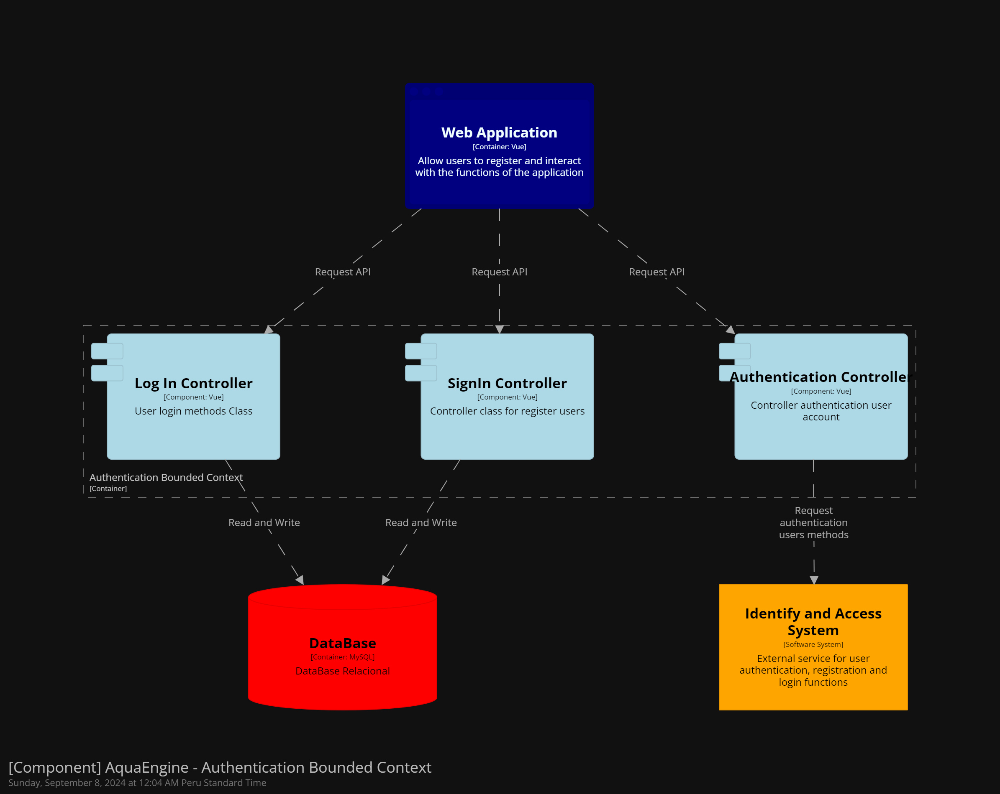

**Generate Invoice Bounded Context**


**Manage Inventory Bounded Context**

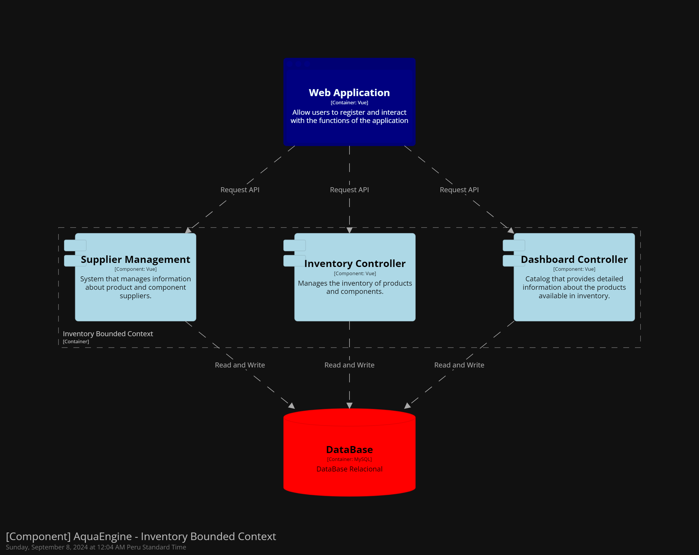

**Monitoring Bounded Context**


**Request Orders Bounded Context**

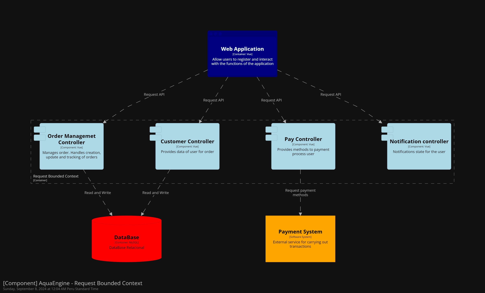

## 4.7. Software Object-Oriented Design.
### 4.7.1. Class Diagrams.
En esta sección se mostrará el diagrama de las relaciones entre las clases que usará nuestra solución de software, utilizando patrones de software para un uso adecuado
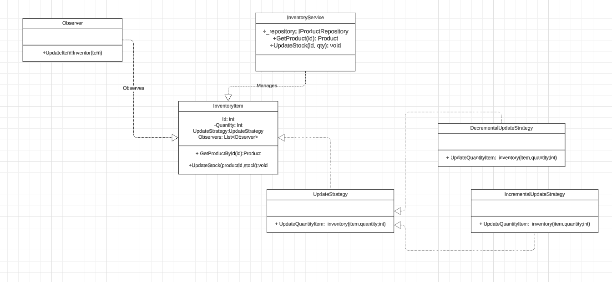

El diagrama describe la gestión de ítems de inventario. InventoryItem representa un ítem en stock, y tiene una estrategia de actualización que puede ser incremental o decremental, implementada por las clases IncrementalUpdateStrategy y DecrementalUpdateStrategy. InventoryService maneja la obtención y actualización del stock de productos, y la clase Observer monitorea los cambios en los ítems del inventario.

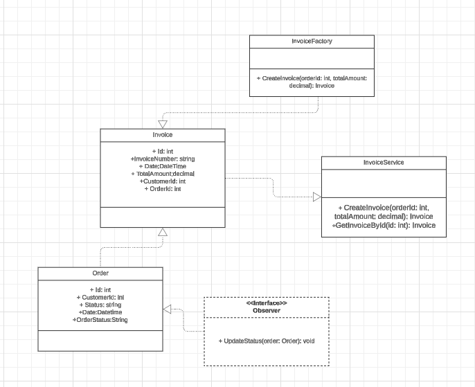

El diagrama muestra la creación y gestión de facturas en relación con los pedidos. Invoice contiene información detallada de la factura, como el número, monto total y cliente asociado, y es creada por InvoiceFactory. InvoiceService se encarga de la generación y consulta de facturas. La interfaz Observer se utiliza para actualizar el estado de los pedidos relacionados con las facturas.

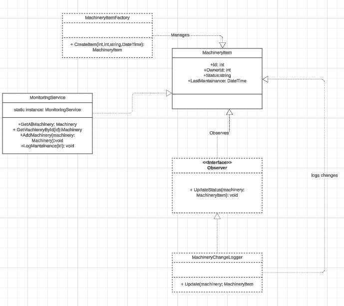

El diagrama muestra cómo se gestiona la maquinaria en el sistema. MachineryItem es la clase central que representa una máquina con su estado, dueño y última fecha de mantenimiento. La clase MachineryItemFactory crea ítems de maquinaria, mientras que MonitoringService gestiona el monitoreo de todas las máquinas y su estado. La interfaz Observer permite observar cambios en el estado de la maquinaria, implementada por MachineryChangeLogger para registrar dichos cambios.

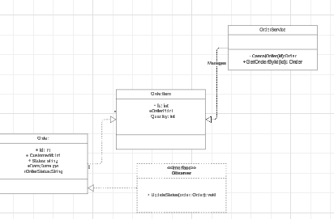

Este diagrama representa la gestión de pedidos en el sistema. La clase Order maneja la información principal del pedido, como el cliente y el estado, y OrderItem representa los ítems específicos dentro del pedido. OrderService gestiona la creación y recuperación de los pedidos. La interfaz Observer sigue el patrón de observador para monitorear cambios en el estado de los pedidos.

### 4.7.2. Class Dictionary.

#### MachineryItem Class:
Esta clase representa un ítem de maquinaria que es monitoreado dentro del sistema. Contiene detalles como su ID, propietario, estado y la última fecha de mantenimiento.

Atributos:
- id: Identificador único de la maquinaria.
- ownerId: Identificador del propietario de la maquinaria.
- status: Estado actual de la maquinaria (por ejemplo, activo, inactivo).
- lastMaintenance: Fecha del último mantenimiento de la maquinaria.

Métodos:

- MachineryItem(id, ownerId, status, lastMaintenance): Constructor de la clase para inicializar un ítem de maquinaria.

#### MachineryItemFactory Class:
Es una fábrica para la creación de ítems de maquinaria. Sigue el patrón de diseño de Factory, lo que permite la creación de maquinaria con atributos definidos.

Métodos:
- createItem(id, ownerId, status, lastMaintenance): Crea y devuelve una nueva instancia de MachineryItem.
#### MonitoringService Class:
Esta clase sirve como servicio central para gestionar la maquinaria. Provee una instancia estática (singleton) para mantener y monitorear todas las instancias de maquinaria en el sistema.

Atributos:

- instance: Instancia única de MonitoringService.

Métodos:
 - getAllMachinery(): Devuelve la lista de toda la maquinaria registrada.
 - getMachineryById(id): Devuelve una instancia específica de maquinaria basada en su ID.
 - addMachinery(machinery): Añade una nueva instancia de maquinaria al sistema.
 - logMaintenance(id): Registra una acción de mantenimiento en una maquinaria.
#### Observer Interface:
Es una interfaz que define un contrato para observar y reaccionar a los cambios en el estado de los ítems de maquinaria.

Métodos:
- updateStatus(machinery): Actualiza el estado del ítem de maquinaria cuando se produce un cambio.
#### MachineryChangeLogger Class:
Implementa la interfaz Observer y se encarga de registrar los cambios en el estado de las máquinas, como parte de un sistema de auditoría o logging.

Métodos:
 - update(machinery): Registra los cambios que ocurren en la maquinaria.

### InventoryItem Class:
Representa un ítem en el inventario. Contiene detalles como la cantidad y la estrategia de actualización para gestionar su stock.

Atributos:
- id: Identificador único del ítem de inventario.
- quantity: Cantidad disponible del ítem.
- updateStrategy: Estrategia usada para actualizar la cantidad de stock.
### UpdateStrategy Class:
Es una clase abstracta que define el comportamiento para actualizar el stock de un ítem de inventario. Se extiende mediante estrategias específicas.

Métodos:
 - updateQuantity(inventory, quantity): Método abstracto que se implementa para actualizar la cantidad de un ítem de inventario.
### IncrementalUpdateStrategy Class:
Clase que implementa la estrategia para incrementar la cantidad de stock en el inventario.

Métodos:
 - updateQuantity(inventory, quantity): Incrementa la cantidad de stock de un ítem de inventario.
### DecrementalUpdateStrategy Class:
Clase que implementa la estrategia para decrementar la cantidad de stock en el inventario.

Métodos:
- updateQuantity(inventory, quantity): Decrementa la cantidad de stock de un ítem de inventario.
### InventoryService Class:
Este servicio se encarga de la gestión del inventario. Permite obtener productos y actualizar su cantidad en stock.

Métodos:
 - getProduct(id): Recupera un producto por su ID.
 - updateStock(id, qty): Actualiza el stock de un producto basado en su ID y la cantidad especificada.
### Invoice Class:
Representa una factura dentro del sistema. Contiene información sobre el monto total, el cliente, el número de factura, y la fecha de emisión.

Atributos:
- id: Identificador único de la factura.
- invoiceNumber: Número de la factura.
- date: Fecha de emisión de la factura.
- totalAmount: Monto total de la factura.
- customerId: Identificador del cliente al que se le emitió la factura.
- orderId: Identificador del pedido asociado a la factura.
### InvoiceFactory Class:
Es una fábrica que se encarga de crear instancias de facturas. Utiliza el patrón Factory para estandarizar la creación de facturas.

Métodos:
- createInvoice(orderId, totalAmount): Crea una nueva instancia de Invoice basada en el pedido y el monto total.
### InvoiceService Class:
Clase que actúa como servicio para gestionar facturas en el sistema. Puede crear facturas o recuperar facturas por su ID.

Métodos:
- createInvoice(orderId, totalAmount): Crea una nueva factura.
- getInvoiceById(id): Recupera una factura por su ID.

### Order Class:
Representa un pedido realizado por un cliente dentro del sistema. Contiene información relevante del pedido, como el ID del cliente, su estado, y la fecha de creación.

Atributos:
- id: Identificador único del pedido.
- customerId: ID del cliente que realizó el pedido.
- status: Estado del pedido (en proceso, completado, cancelado).
- createdDate: Fecha de creación del pedido.
- orderStatus: Estado específico del pedido (como pendiente, enviado).
### OrderItem Class:
Representa un ítem específico dentro de un pedido. Incluye detalles sobre el ítem, como la cantidad y el ID del pedido asociado.

Atributos:
- id: Identificador único del ítem.
- orderId: Identificador del pedido al que pertenece el ítem.
- quantity: Cantidad del ítem en el pedido.
### OrderService Class:
Es un servicio que gestiona la creación y recuperación de pedidos dentro del sistema.

Métodos:
- createOrder(customerId, items): Crea un nuevo pedido para un cliente y lo asocia con una lista de ítems.
- getOrderById(id): Recupera un pedido basado en su ID.

## 4.8. Database Design
### 4.8.1. Database Diagram
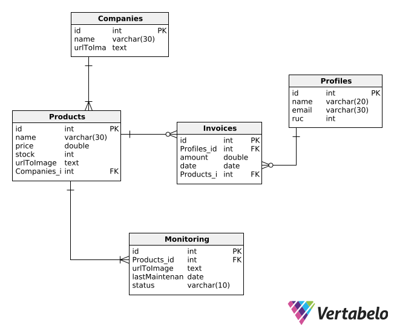

# Capítulo V: Product Implementation, Validation & Deployment
## 5.1. Software Configuration Management.
### 5.1.1. Software Development Environment Configuration.

En esta sección se proporcionan los enlaces a las aplicaciones y productos de software que utilizaremos durante el desarrollo del proyecto.

Con ese fin, se organizará en las siguientes secciones: 

* Project Management
* Requirements Management
* Product UX/UI Design
* Software Development
* Software Testing
* Software Documentation

Asimismo, se clasificarán los elementos de estas secciones como rutas de referencia (para software basado en modelos Saas) o rutas de descarga (para productos que se ejecuten en las computadoras de los miembros del equipo) para cada uno de los productos de software.

**Project Management**

Esta disciplina se fundamenta en la administración de proyectos y busca principalmente la mejora de procesos y su entorno con el propósito de lograr los resultados esperados.

* Durante el ciclo digital del proyecto, se llevará a cabo la implementación de un producto de software basado en el modelo SaaS, el cual funcionará a través de un navegador web; no obstante, no se desarrollará una versión de la aplicación móvil correspondiente.

**Requirements Management:**

Este proceso se enfoca en asegurar que una organización documente, verifique y satisfaga las necesidades y expectativas de sus clientes, así como las de las partes interesadas internas o externas.

* **Pivotal Tracker:** Esta herramienta se describe como una plataforma que facilita la gestión de las historias de usuario, organizándolas en epopeyas y evaluando su importancia en el programa según su puntuación. Se utilizó debido a su capacidad para permitir que cada miembro del equipo comparta una vista en tiempo real de los avances en cada proyecto, contribuyendo con diferentes secciones o ajustando el flujo del proyecto.

**Product UX/UI Design**

Esta herramienta facilita la creación digital de modelos que se integran en la vida del consumidor. En este caso, estamos desarrollando un modelo de sitio web compatible tanto con computadoras como con dispositivos móviles.

Para lograrlo, utilizamos varias herramientas de diseño y colaboración, que incluyen:

* **Uxpressia:** Uxpressia es una plataforma en línea especializada en el mapeo de la trayectoria del cliente. Nos ayuda a crear mapas de impacto y perfiles de usuario, como User Personas, Empathy Maps y Journey Maps. Puedes encontrar más información sobre Uxpressia en [este enlace](https://uxpressia.com/).
* **MIRO:** MIRO es una pizarra digital colaborativa en línea que se adapta a diversas actividades colaborativas, como investigación, ideación, creación de lluvias de ideas y mapas mentales. Es una herramienta versátil que facilita el trabajo en equipo. Descubre más sobre MIRO en [su sitio web](https://miro.com/app/dashboard/).
* **Figma:** Figma es una herramienta de prototipado web y un editor de gráficos vectoriales. A diferencia de otras herramientas, Figma se ejecuta en línea, lo que permite crear modelos que funcionan tanto en navegadores web como en navegadores móviles. Puedes explorar Figma en [este enlace](https://www.figma.com/design/).
* **Lucid Chart:** Esta es una aplicación de diagramación en línea que permite a los usuarios colaborar y trabajar juntos en tiempo real para crear una variedad de diseños, incluidos diagramas UML, mapas mentales, prototipos de software y otros tipos de diagramas. Puedes conocer más acerca de Lucid Chart en [este enlace](https://lucid.app/lucidchart/).
* **Overflow:** Overflow es una herramienta de diagramación que ofrece la posibilidad de colaborar en tiempo real. Utilizamos esta herramienta para crear diagramas de Userflows. Si deseas obtener más información sobre Overflow, visita [su sitio web](https://userflow.com/app/).

Estas herramientas nos ayudan a dar vida a nuestros diseños digitales y a garantizar que nuestros productos sean accesibles y atractivos en diferentes plataformas.

**Software Development:**

* **GitHub:** Esta es una plataforma digital donde se pueden alojar proyectos mediante repositorios, los cuales utilizan un sistema de control de versiones llamado Git. GitHub nos permite trabajar colaborativamente y tener un seguimiento detallado de los avances en el proyecto. Para acceder a nuestro repositorio utiliza [este enlace](https://github.com/Dotvue).

* **Git:** Este es un software de control de versiones el cual se instala localmente y nos permite tener un historial de cambios que se realizan en el proyecto mediante commits. También se utiliza para trabajar colaborativamente en repositorios que se encuentran subidos en GitHub. Para descargar Git utiliza [este enlace](https://git-scm.com).

* **WebStorm:** Este es un entorno de desarrollo, el cual nos permite trabajar con HTML, CSS, Javascript y con frameworks como Vue y Angular. Para obtener WebStorm utiliza [este enlace](https://www.jetbrains.com/es-es/webstorm/).

* **Rider:** Este es un entorno de desarrollo, el cual nos permite trabajar con el lenguaje C# y la plataforma .NET que nos permite crear diferentes tipos de aplicaciones, ya sean móvil, web o de escritorio. En nuestro caso, usaremos ASP .NET para crear un Web Service para nuestro proyecto. Para obtener Rider utiliza [este enlace](https://www.jetbrains.com/es-es/rider/).

**Software Testing:**

Se trata de la acción de evaluar los elementos y el funcionamiento del software sometido a prueba mediante procesos de validación y verificación.

**Lenguaje Gherkin:** Este lenguaje, conocido como DSL (Lenguaje Específico de Dominio), está diseñado específicamente para abordar problemas particulares. Además de poder ser interpretado en código, permite agregar historias de usuario del programa junto con sus componentes correspondientes, como Característica, Escenario, Ejemplo, Esquema de Escenario, Dado, Cuando, Entonces y Y.

**Software Documentation**

Se refiere a textos escritos o ilustraciones que acompañan al software de computadora o están integrados en su código fuente. Esta documentación tiene como objetivo explicar cómo funciona el software o cómo utilizarlo.

### 5.1.2. Source Code Management.

En esta sección se detalla qué medios se utilizaron para el seguimiento de las modificaciones, así como la semántica y nomenclatura que se usará para los commits y releases que se implementarán durante el avance del proyecto.

Antes que nada, hay que mencionar que se utilizará GitHub como sistema de control de versiones del informe, landing page, web service y frontend de nuestro proyecto. Para ello se crearon sus respectivos repositorios:

* Url de la organización: [github.com/Dotvue](https://github.com/Dotvue)
* Repositorio Landing page: [github.com/Dotvue/AquaEngine-landing-page](https://github.com/Dotvue/AquaEngine-landing-page)

**GitFlow:**

Git Flow es un modelo de trabajo el cual consta de ramas principales y ramas de apoyo. Decidimos utilizar este modelo ya que nos permite mantener el código de nuestro proyecto limpio y ordenado al dividirlo en ramas, de tal forma que nos facilita trabajar colaborativamente. Además, lo que hace eficiente a GitFlow es que presenta una gran variedad de ramas, las cuales son:

* **Ramas Principales:**
    * **Main:** Esta es la rama principal desde donde se ramifican todas las demás. Además, contiene el código fuente que está listo para producción y cada cambio que se realice en esta se consideraría como una nueva versión del proyecto
    * **Develop:** Esta rama surge a partir de la rama Main y se utiliza para integrar las funcionalidades trabajadas en las ramas posteriores. Aquí se acopla todo el código que está listo para pasar a la rama Main y crear una nueva versión (Release) de nuestro proyecto.

* **Ramas de Apoyo:**

    * **Feature:** Estas son ramas creadas a partir Develop y se crean tantas como funcionalidades presenta nuestro proyecto. Una vez se termina de trabajar en estas ramas, deben fusionarse con la rama Develop para posteriormente ser eliminada. La nomenclatura que se utiliza es la siguiente:

            feature/benefits
            feature/profile
            feature/memberships

    * **Release:** Estas son ramas creadas a partir de Develop y sirven para preparar una nueva versión de nuestro proyecto que está listo para publicar. Cabe destacar que, en caso se requiera agregar nuevas funcionalidades, se tendrá que crear otra rama Release siguiendo las normas del Semantic Versioning 2.0.0, la cual se explicará más adelante.

    * **Hotfix:** Estas ramas son creadas a partir del Main y sirven para corregir rápidamente los errores que se presentan en el código publicado en esa rama (Main). Cabe destacar que una vez corregido el error, las ramas Hotfix deben fusionarse con las ramas Main y Develop.


**Semantic Versioning**

Este es un conjunto de reglas que nos permitirán gestionar correctamente la numeración de versiones de nuestro proyecto, para ello lo implementaremos en las ramas Release siguiendo el formato X.Y.Z (Major, Minor, Patch)

* **Versión de Parche (Z):** Se incrementa solo si se implementan correcciones compatibles con versiones anteriores.

* **Versión Secundaria (Y):** Se incrementa cuando se agregan nuevas funcionalidades que son compatibles con versiones anteriores.

* **Versión Principal (X):** Se incrementa cuando los cambios agregados no son compatibles con las versiones anteriores. Cabe destacar que al incrementar este parámetro, la enumeración de los parámetros Y y Z se inicializan en 0.

        release-1.0.5
        release-2.1.3
        release-2.2.1

**Conventional Commits**

Este es un conjunto de reglas, las cuales deben seguir nuestros commits para crear un historial explícito de los cambios realizados en el proyecto, haciéndolo más sencillo de comprender para el equipo de desarrollo. Los conventional commits siguen la siguiente estructura: 

    <type> [opcional scope]: <description>
    [optional body]
    [optional footer]

* **type:** Dependiendo del cambio que se realicen en el proyecto, los commits pueden ser:
    * **feat:** Cuando se agrega una nueva funcionalidad (feature)
    * **docs:** Cuando se realizan cambios en la documentación del proyecto
    * **fix:** Cuando se corrige un error en el código
    * **chore**: Cuando se realizan cambios que no afectan al código
    * **refactor:** Cuando se realizan cambios es la estructura del código, sin afectar al comportamiento del proyecto
    * **build**: Cuando se realizan cambios en los componentes del proyecto, como dependencias externas.
    * **perf:** Cuando se realizan cambio que mejoran el rendimiento del proyecto
* **scope:** Este es un campo opcional, que nos permite especificar el alcance que tiene el commit.
* **description:** Este es un campo obligatorio, ya que proporciona información breve y concisa de los cambios que se han realizado. Además debe ser escrito en minúsculas y de modo imperativo
* **body:** Este es un campo opcional en el cual se detalla más información sobre el commit, como el motivo del cambio. 
* **footer:** Este es un campo opcion y se utiliza para informar respecto a cambios importantes en el proyecto

### 5.1.3. Source Code Style Guide & Conventions.
**Nomenclatura General**

Para los nombres de variables, objetos, elementos y funciones no se utilizarán mayúsculas en estos nombres, ya que, de acuerdo con W3Schools (sin fecha), puesto que la combinación entre mayúsculas y minúsculas puede dificultar la legibilidad del código.

Ejemplos de nomenclatura estándar, siguiendo las recomendaciones de Google (s.f.):

```
.gallery {}
.video {}
.login {}
```

**Sangría**

Al trabajar con HTML, CSS y/o JavaScript, se aplicará un espaciado de dos espacios antes de cada línea que se encuentre dentro de un bloque. Según W3Schools (sin fecha), no se recomienda el uso de la tecla "Tabulación". 

Ejemplo de nomenclatura estándar de la sangría HTML según W3Schools(s.f):
``` html
<!DOCTYPE html>
<html>
  <head>
    <title>Título</title>
  </head>
  <body>
    <h1>Encabezado</h1>
    <p>Párrafo.</p>
  </body>
</html>
```


Ejemplo de formato estándar de sangría en CSS según W3Schools (s.f):

``` CSS
html {
  background: #fff; /* Fondo blanco */
  color: #404;     /* Color de texto gris */
}
```

Ejemplo de nomenclatura estándar de la sangría en JavaScript según W3School (s.f.):

``` JavaScript
function toCelsius(fahrenheit) {
  return (5 / 9) * (fahrenheit - 32);
}
```

**HTML:**


HTML, acrónimo de HyperText Markup Language en inglés, es un lenguaje de marcado que se utiliza para definir la estructura de una página web. También incluye funcionalidades que permiten controlar el comportamiento de diferentes elementos del contenido de la página, como cambiar el tamaño del texto o aplicar formato cursiva, entre otros. En nuestro proyecto, emplearemos HTML5, y las pautas a seguir para utilizar este lenguaje de la siguiente manera:

* **Declare Document Type**
La declaración del tipo de documento debe realizarse en la primera línea del código. Según Google (s.f.), se prefiere la sintaxis de HTML5 para todos los documentos HTML. Para declararla, simplemente copia lo siguiente:

``` html
<!DOCTYPE html>
```

* **Blank**
Cada vez que comienza un nuevo bloque, lista o tabla de gran longitud, es recomendable dejar una línea en blanco después del elemento anterior para mejorar la legibilidad y la presentación del código, de acuerdo con las pautas de W3Schools (s.f.).
Ejemplo:

``` html
<body>

<h1>Famous Cities</h1>

<h2>Tokyo</h2>
<p>Tokyo is the capital of Japan, the center of the Greater Tokyo Area, and the most populous metropolitan area in the world.</p>

<h2>London</h2>
<p>London is the capital city of England. It is the most populous city in the United Kingdom.</p>

<h2>Paris</h2>
<p>Paris is the capital of France. The Paris area is one of the largest population centers in Europe.</p>

</body>
```

Esta práctica de dejar una línea en blanco mejora la estructura y legibilidad del código HTML.

* **Quote attribute Values**
Para los valores de los atributos, aunque no sea una caractística obligatoria,es común utilizar comillas dobles alrededor de ellos. Según W3Schools (s.f), esto hace el código más legible y es una práctica común entre los desarrolladores. 
Ejemplo:

``` html
<table class="striped">
```

Este enfoque de usar comillas dobles alrededor de los valores de los atributos es ampliamente aceptado y recomendado en la comunidad de desarrollo web.

* **Never Skip the \<title> Element**
El elemento `<title>` permite que las páginas aparezcan en la lista de resultados al realizar búsquedas en un navegador web. Además, este elemento es responsable de proporcionar el nombre de la página cuando se agrega a marcadores o favoritos.
Ejemplo:

``` html
<title>HTML Style Guide and Coding Conventions</title>
```

Este elemento es esencial para mejorar la identificación y accesibilidad de una página web.

* **HTML Line-Wrapping**
A pesar de que  no exista un límite de palabras por línea en un documento HTML, no se recomienda generar líneas de código excesivamente largas. Para la siguiente línea, se deben utilizar al menos cuatro espacios para distinguir elementos secundarios.
Ejemplo según Google (s.f):

``` html
<button mat-icon-button color='primary' class="menu-button"
(click)="openMenu()">
<mat-icon>menu</mat-icon>
</button>
```


**CSS:**

Conocido así por el acrónimo de su nombre en inglés, Cascading Style Sheets, es un lenguaje que se enfoca en definir y mejorar la presentación de un documento basado en HTML. Las pautas a seguir al utilizar CSS son:

* **Shorthand Properties**
Se debe declarar los campos de los elementos en la menor cantidad de líneas posible, según Google (s.f). esto mejora la eficiencia del código y lo hace más legible. Además, se debe evitar agregar unidades después del valor cero.

Ejemplo segpun Google (s.f):

``` css
border-top: 0;
font: 100%/1.6 palatino, georgia, serif;
padding: 0 1em 2em;
```

* **Declaration**
Es importante incluir un espacio entre el nombre del selector del elemento y la llave que inicia el bloque de CSS. Tambien es necesario incluir un espacio entre los dos puntos que siguen del nombre de una propiedad y su valor correspondiente. Como en la mayoría de lenguajes de programación, debe colocarse punto y coma al final de cada declaración en CSS, según Google (s.f), esta práctica contribuye a mantener la coherencia en el código.

Ejemplo según Google (s.f)

``` css
html {
  background: #fff;
  color: #404;
}
```

* **CSS quotation Marks**
No se deben utilizar comillas dobles (`"`) en el código CSS; en su lugar, se permiten y deben emplearse comillas simples (`'`) únicamente para selectores de atributos y valores de propiedades.
Ejemplo conforme a las pautas estándar de Google (sin fecha):

``` css
html {
  font-family: 'open sans', arial, sans-serif;
}
```

Este ejemplo demuestra el uso de comillas simples para encerrar el valor del atributo `font-family` en CSS, lo cual es una práctica común y aceptada.

**JavaScript**

JavaScript es un lenguaje de programación que permite especificar de manera precisa las acciones que debe realizar el navegador web, incluyendo el orden de ejecución de tareas y la frecuencia con la que se deben llevar a cabo. A continuación, se presentan las pautas para el uso de JavaScript en nuestro proyecto:

* **Spaces around operators**
Se debe colocar un espacio alrededor de cada operador matemático y tambien dcomas que se usen en el código JavaScript. 
Ejemplo estándar de W3Schools (s.f):

``` javascript
let x = y + z;
const myArray = ['Volvo', 'Saab', 'Fiat'];
```

El uso consistente de espacios alrededor de operadores y comas mejora la legibilidad del código JavaScript.

* **Simple Statement's End**
Como en el caso de muchos otros lenguajes de programación, se debe terminar una declaración con punto y coma.
Ejemplo estándar según W3Schools (s.f):

``` javascript
const cars = ['Volvo', 'Saab', 'Fiat'];

const person = {
  firstName: "John",
  lastName: "Doe",
  age: 50,
  eyeColor: "blue"
};
```

* **Beginning and End of Function**
Un bloque de función debe incluir una llave al final de la primera línea, de modo que el cierre de la función esté en la última línea, sin necesidad de un punto y coma. Esto mismo se aplica a las estructuras condicionales y los bucles. 
Ejemplo estándar según W3Schools (s.f):

``` javascript
function toCelsius(fahrenheit) {
  return (5 / 9) * (fahrenheit - 32);
}
```

* **Object Rules**
Para la creación de un objeto, al igual que en una función, se comienza con una llave al final de la primera línea, pero en este caso, la llave de cierre debe ir seguida de un punto y coma. Para definir las propiedades del objeto, coloque dos puntos y un espacio para indicar su valor. Si el valor es un string, se debe encerrar entre comillas dobles.
Ejemplo estándar según W3Schools (s.f):

``` javascript
const person = {
  firstName: "John",
  lastName: "Doe",
  age: 50,
  eyeColor: "blue"
};
```

**Gherkin:**

Gherkin es un Lenguaje Específico de Dominio (DSL) que se utiliza para resolver problemas específicos mediante la generación de casos de prueba que validan una característica en diversos escenarios. Gherkin incluye varios elementos, entre los cuales los más conocidos y utilizados son Feature, Scenario, Example, Given, When y Then. A continuación, se presentan las pautas que debemos seguir al utilizar Gherkin en nuestro código:

* **Discernible Given-When-Then Blocks**
Es importante aplicar sangría a los elementos que representan los pasos a seguir en un escenario. En el caso de "And", se debe aplicar una sangría adicional. Siguiendo la recomendación de Keiblinger (2021), este enfoque ayuda a identificar rápidamente las partes que componen un escenario. A continuación, se muestra un ejemplo:

``` gherkin
Scenario: Administrador accedde al catálogo de menús diarios
  Given que el administrador está autenticado en la plataforma de administración
  When el administrador navega a la sección de "Catálogo de Menús" o "Menúes diarios"
    Then el sistema debería mostrar una lista de menús diarios proporcionados por los restaurantes afiliados
      And proporcionar opciones de filtrado y búsqueda para facilitar la selección
      And permitir al administrador ver los detalles de cada menú, como nombre, descripción y precio
```


* **Step with Tables**
Según Keiblinger (2021), cuando sea necesario introducir valores en partes del escenario, se debe emplear una tabla o crear un formulario que refleje esa parte del escenario. Antes de esta representación, se deben colocar dos puntos.
Ejemplo:

``` gherkin
Then se mostrará el mensaje:
  | Mensaje |
  | Se completaron los requisitos adecuadamente |
```

* **Reducing Noise**
Con el propósito de reducir la acumulación de líneas de código excesivas en un escenario, los valores predeterminados deben colocarse en pasos para campos que no están muy relacionados con el escenario. Los valores "estándar" que coloquemos deben ir entre comillas simples. Según Keiblinger (2021), esta operación reduce considerablemente el tamaño del código.
Ejemplo:

``` gherkin
When escribo claramente los requisitos 'dominio en C'
```

* **Scenarios Separator**
Para separar dos escenarios, se debe insertar un salto de línea y, según Keiblinger (2021), de ser posible, agregar una línea de comentario para facilitar la legibilidad de estos. De esta manera, se identifica rápidamente el inicio y el fin de un escenario. 
Ejemplo:

``` gherkin
Scenario: Administrador recibe notificación sobre estado del pedido
Given que el administrador está autenticado en la plataforma de administración
When el estado de un pedido cambia, por ejemplo, de "Pendiente" a "En Preparación" o "Entregado"
  Then el sistema debería enviar una notificación al administrador sobre el cambio de estado del pedido
    And la notificación debería incluir detalles relevantes del pedido, como número de pedido, estado actual, fecha y hora estimada de entrega

# --------------------------

Scenario: Otro escenario
Given que en otro contexto
When ocurre algo diferente
  Then se muestra otro resultado
```

### 5.1.4. Software Deployment Configuration.

Dado que hemos mencionado anteriormente, la administración de nuestro código fuente se llevará a cabo mediante GitHub. Además, utilizaremos GitHub Pages para la publicación y despliegue de la página.

En cuanto al desarrollo del landing page, estamos utilizando el repositorio ubicado en el siguiente URL: https://github.com/orgs/Dotvue/repositories

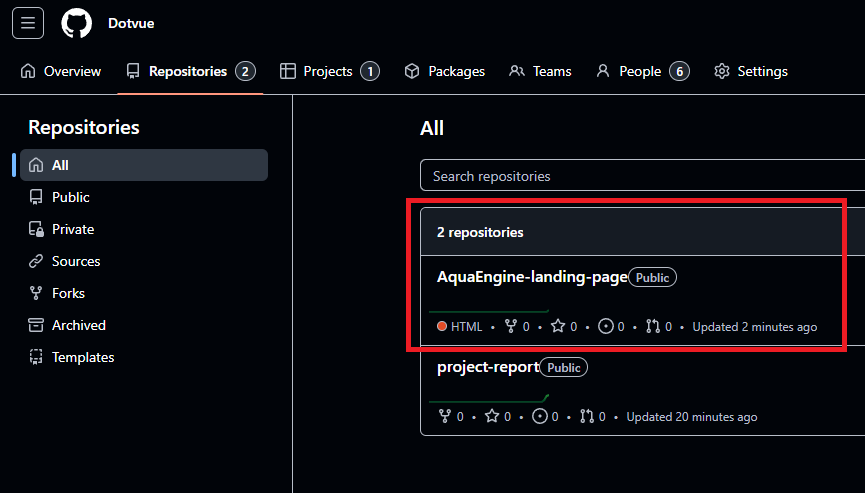

Para desplegar la Landing Page de manera local descargamos el zip, o podemos clonar el repositorio con la herramienta git y el comando: 

    git clone + URL repository

La URL del repositorio se ubica en la siguiente sección de cada repositorio en GitHub:

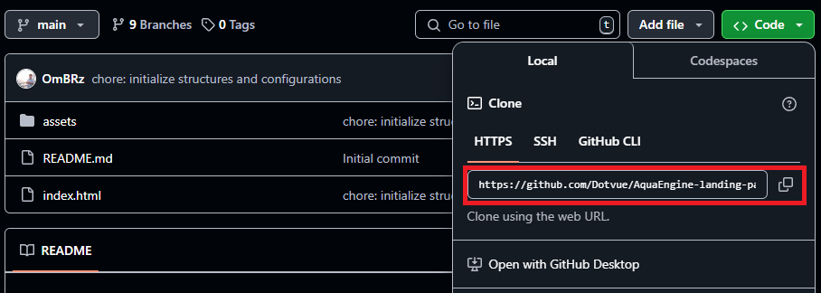

Desde el IDE de nuestra preferencial (para muestras de ejemplo se usará Webstorm de Jetbrains) seleccionamos la opción “Get from VCS” e insertamos la URL que obtuvimos del repositorio.

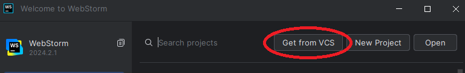

## 5.2. Landing Page, Services & Applications Implementation.
### 5.2.1. Sprint 1

En la etapa inicial de nuestro proyecto, decidimos llevar a cabo la implementación del diseño de nuestra Landing Page utilizando WebStorm como el entorno de desarrollo.

Repositorio Github: https://github.com/Dotvue/AquaEngine-landing-page
#### 5.2.1.1. Sprint Planning 1.

Para el primer sprint el equipo establecio que el desarrollo de las tareas serian unas 18 horas.

<table>
    <thead>
        <tr>
            <th>Sprint #</th>
            <th>Sprint 1</th>
        </tr>
    </thead>
    <tbody>
        <tr>
            <td colspan="2"><b>Sprint Planning Background</b></td>
        </tr>
        <tr>
            <td>Date</td>
            <td>2024/09/04</td>
        </tr>
        <tr>
            <td>Time</td>
            <td>10:30 PM</td>
        </tr>
        <tr>
            <td>Location</td>
            <td>Google meet</td>
        </tr>
        <tr>
            <td>Prepared by</td>
            <td>Daniel Mateo del Castillo Bueno</td>
        </tr>
        <tr>
            <td>Atendees (to planning meeting)</td>
            <td>
                <li>Gonzalo Andre Zavala Quedena</li>
                <li>Omar Christian Berrocal Ramirez</li>
                <li>Pedro Andre Guía Carrasco</li>
                <li>Sebastian Andres Aiquipa Poma</li>
            </td>
        </tr>
        <tr>
            <td>Sprint 1 Review Summary</td>
            <td>
                Este es el primer sprint a realizar por el equipo
            </td>
        </tr>
        <tr>
            <td>Sprint 1 Retrospective Summary</td>
            <td>
                Acuerdo de la implementación de una primera versión del Landing Page  
            </td>
        </tr>
        <tr>
            <td colspan="2"><b>Sprint Goal & User Stories</b></td>
        </tr>
        <tr>
            <td>Sprint 1 Goal</td>
            <td>
                <li>Desarrollar una landing page usando html,css y js.</li>
                <li>landing page responsive</li>
            </td>
        </tr>
        <tr>
            <td>Sprint 1 Velocity</td>
            <td>
                ?
            </td>
        </tr>
        <tr>
            <td>Sum of story points</td>
            <td>
                ?
            </td>
        </tr>
    </tbody>
</table>

#### 5.2.1.2. Sprint Backlog 1.
Para el primer sprint el equipo establecio que el desarrollo de las tareas serian unas 20 horas.
Enlaze al product backlog con las tareas correspondientes: https://www.pivotaltracker.com/projects/2717945

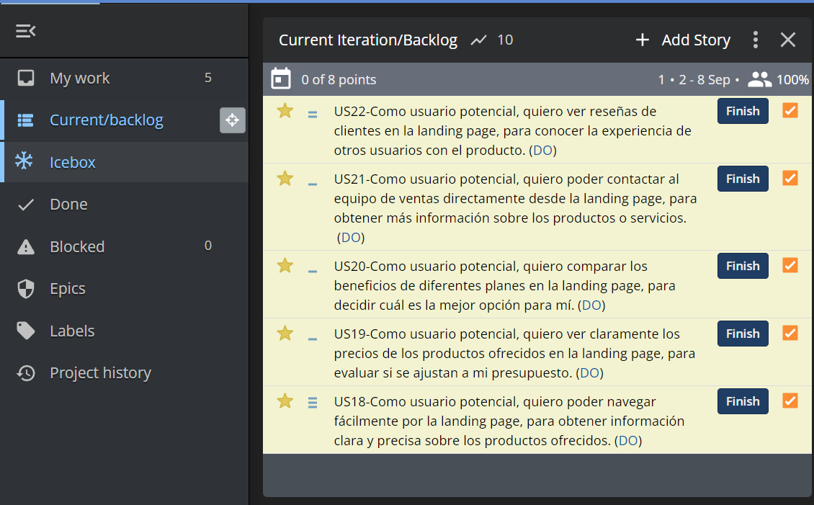

<table>
  <tr>
    <td> <strong>Sprint #</strong></td>
    <td align="center" colspan="7"> <strong>Sprint 1</strong> </td>
  </tr>

   <tr>
    <td align="center" colspan="2"> <strong>User Story</strong></td>
    <td align="center" colspan="6"> <strong>Work-item/Task</strong></td>
  </tr>
  <tr>
    <td align="center"> <strong>ID</strong> </td>
    <td align="center"> <strong>Title<strong></td>
    <td align="center"> <strong>ID</strong> </td>
    <td align="center"> <strong>Title<strong></td>
    <td align="center"> <strong>Description<strong></td>
    <td align="center"> <strong>Estimation (Hours)<strong></td>
    <td align="center"> <strong>Assigned To<strong></td>
    <td align="center"> <strong> Status (To-do/In-Process/To-Review/Done)  <strong></td>
  </tr>
  <!---------------------------------------------------------------------- -->
  <tr>
    <td rowspan="4" align="center"> ID </td>
    <td rowspan="4" align="center"> US18 Navegación por la Landing Page</td>
    <td align="center"> TA01 </td>
     <td align="center"> menu con hipervinculos responsive</td>
    <td align="center">Cada Hipervinculo debe de rediriguirte a una seccion especifica de la landing page </td>
    <td align="center"> 2</td>
    <td align="center"> Gonzalo Andre Zavala Quedena</td>
    <td align="center">Done</td>
  </tr>

  <tr>
    <td align="center"> TA02 </td>
    <td align="center"> menu de navegacion mobile</td>
    <td align="center"> Se debe desarrollar el menu mobile, haciendo uso de un icono que despliegue los hipervinculos</td>
    <td align="center"> 2</td>
    <td align="center"> Gonzalo Andre Zavala Quedena</td>
    <td align="center">Done</td>
  </tr>

   <tr>
    <td align="center"> TA03 </td>
    <td align="center"> Hero</td>
    <td align="center"> Se debe desarrollar un banner con una frase y un botón call to action que permita dirigirnos a la aplicación web.</td>
    <td align="center"> 2</td>
    <td align="center"> Daniel Mateo del Castillo Bueno</td>
    <td align="center">Done</td>
  </tr>
  <tr>
    <td align="center"> TA04 </td>
    <td align="center"> Hero responsive</td>
    <td align="center"> Esta seccion debe de ajustarse el diseño dependiendo del tamaño de la pantalla del navegador.</td>
    <td align="center"> 1</td>
    <td align="center"> Daniel Mateo del Castillo Bueno</td>
    <td align="center">Done</td>
  </tr>
<!----------------------------------------------->
  <tr>
    <td rowspan="2" align="center"> ID </td>
    <td rowspan="2" align="center"> US19 Visualización de Precios</td>
    <td align="center"> TA01 </td>
    <td align="center"> Planes</td>
    <td align="center"> Debe de representar la informacion del uso de la aplicacion a traves de iconos o imagenes</td>
    <td align="center"> 1</td>
    <td align="center"> Sebastian Andres Aiquipa Poma</td>
    <td align="center">Done</td>
  </tr>

  <tr>
    <td align="center"> TA02 </td>
    <td align="center"> Seccion Responsive </td>
    <td align="center"> Esta seccion debe de ajustarse el diseño dependiendo del tamaño de la pantalla del navegador </td>
    <td align="center"> 2</td>
    <td align="center"> Sebastian Andres Aiquipa Poma</td>
    <td align="center"> Done</td>
  </tr>
<!-------------------------------------------------->
  <tr>
    <td rowspan="2" align="center"> ID </td>
    <td rowspan="2" align="center"> US20 Comparación de beneficios</td>
    <td align="center"> TA01 </td>
    <td align="center"> Desarrollo la sección funcionalidad</td>
    <td align="center"> crea la seccion de funcionalidad que muestra los beneficios de la plataforma web.</td>
    <td align="center"> 2</td>
    <td align="center"> Pedro Andre Guía Carrasco</td>
    <td align="center"> Done</td>
  </tr>
   <tr>
    <td align="center"> TA02 </td>
    <td align="center"> Seccion Responsive </td>
    <td align="center"> Esta seccion debe de ajustarse el diseño dependiendo del tamaño de la pantalla del navegador </td>
    <td align="center"> 1</td>
    <td align="center"> Pedro Andre Guía Carrasco</td>
    <td align="center"> Done</td>
  </tr>

<!---------------------------------------------------->
  <tr>
    <td rowspan="3" align="center"> ID </td>
    <td rowspan="3" align="center"> US21 Contacto con ventas desde la landing page</td>
      <td align="center"> TA01 </td>
    <td align="center"> Formulario</td>
    <td align="center"> Se desarrolla un formulario donde se pueda enviar un mensaje al Team.</td>
    <td align="center"> 2</td>
    <td align="center"> Omar Berrocal Ramirez</td>
    <td align="center"> Done</td>
  </tr>

  <tr>
    <td align="center"> TA02 </td>
    <td align="center"> Form responsive </td>
    <td align="center"> Esta seccion debe de tener varias configuraciones para tamaños de pantalla </td>
    <td align="center"> 1</td>
    <td align="center">Omar Berrocal Ramirez</td>
    <td align="center"> Done</td>
  </tr>

  <tr>
    <td align="center"> TA03 </td>
    <td align="center"> Footer</td>
    <td align="center"> Esta seccion debe mostrarse la informacion de contacto y nuestras redes sociales </td>
    <td align="center"> 2</td>
    <td align="center">Gonzalo Andre Zavala Quedena </td>
    <td align="center"> Done</td>
  </tr>
<!------------------------------------------------>
   <tr>
    <td rowspan="1" align="center"> ID </td>
    <td rowspan="1" align="center"> US22 Consulta de reseñas de clientes</td>
    <td align="center"> TA01 </td>
    <td align="center"> Reseñas</td>
    <td align="center"> Se desarrolla secion donde se muestra comentarios de las experiencias de los usuarios de la plataforma web</td>
    <td align="center"> 2</td>
    <td align="center"> Gonzalo Andre Zavala Quedena </td>
    <td align="center"> Done</td>
  </tr>

</table>

#### 5.2.1.3. Development Evidence for Sprint Review.

#### 5.2.X.4. Testing Suite Evidence for Sprint Review.

#### 5.2.X.5. Execution Evidence for Sprint Review.

#### 5.2.X.6. Services Documentation Evidence for Sprint Review.

#### 5.2.X.7. Software Deployment Evidence for Sprint Review.

#### 5.2.X.8. Team Collaboration Insights during Sprint.
 imagenes de colaboraciones github

## 5.3. Validation Interviews.
### 5.3.1. Diseño de Entrevistas.

1. ¿Cuál es su nombre? 
2. ¿Qué edad tiene? 
3. ¿A qué se dedica? 
4. ¿[Opinion de idea de propuesta]? 

### 5.3.2. Registro de Entrevistas.
**Segmento 1**  
Nombre: _____
Edad: _ años 
Ocupación: _____  
  
{texto mucho}

**Segmento 2**  
Nombre: _____
Edad: _ años 
Ocupación: _____  

{texto}

### 5.3.3. Evaluaciones según heurísticas.
| HEURÍSTICA   | EVALUACIÓN  | NOTA      |
| --------------------------------------------- | ---------- | --------- |
| Visibilidad del estado del sistema            |            | {texto}   |
| Coincidencia entre el sistema y el mundo real |            | {texto}   |
| Control y libertad del usuario                |            | {texto}   |
| Consistencia y estándares                     |            | {texto}   |
| Prevención de errores                         |            | {texto}   |
| Mostrar antes que recordar                    |            | {texto}   |
| Flexibilidad y eficiencia de uso              |            | {texto}   |
| Diseño estético y minimalista                 |            | {texto}   |
| Comunicar errores con facilidad               |            | {texto}   |
| Ayuda y documentación                         |            | {texto}   |  
  
## 5.4. Video About-the-Product.

