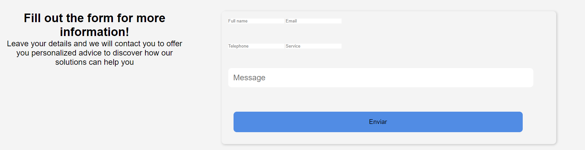

# Capítulo V: Product Implementation, Validation & Deployment
## 5.1. Software Configuration Management.
### 5.1.1. Software Development Environment Configuration.

En esta sección se proporcionan los enlaces a las aplicaciones y productos de software que utilizaremos durante el desarrollo del proyecto.

Con ese fin, se organizará en las siguientes secciones: 

* Project Management
* Requirements Management
* Product UX/UI Design
* Software Development
* Software Testing
* Software Documentation

Asimismo, se clasificarán los elementos de estas secciones como rutas de referencia (para software basado en modelos Saas) o rutas de descarga (para productos que se ejecuten en las computadoras de los miembros del equipo) para cada uno de los productos de software.

**Project Management**

Esta disciplina se fundamenta en la administración de proyectos y busca principalmente la mejora de procesos y su entorno con el propósito de lograr los resultados esperados.

* Durante el ciclo digital del proyecto, se llevará a cabo la implementación de un producto de software basado en el modelo SaaS, el cual funcionará a través de un navegador web; no obstante, no se desarrollará una versión de la aplicación móvil correspondiente.

**Requirements Management:**

Este proceso se enfoca en asegurar que una organización documente, verifique y satisfaga las necesidades y expectativas de sus clientes, así como las de las partes interesadas internas o externas.

* **Pivotal Tracker:** Esta herramienta se describe como una plataforma que facilita la gestión de las historias de usuario, organizándolas en epopeyas y evaluando su importancia en el programa según su puntuación. Se utilizó debido a su capacidad para permitir que cada miembro del equipo comparta una vista en tiempo real de los avances en cada proyecto, contribuyendo con diferentes secciones o ajustando el flujo del proyecto.

**Product UX/UI Design**

Esta herramienta facilita la creación digital de modelos que se integran en la vida del consumidor. En este caso, estamos desarrollando un modelo de sitio web compatible tanto con computadoras como con dispositivos móviles.

Para lograrlo, utilizamos varias herramientas de diseño y colaboración, que incluyen:

* **Uxpressia:** Uxpressia es una plataforma en línea especializada en el mapeo de la trayectoria del cliente. Nos ayuda a crear mapas de impacto y perfiles de usuario, como User Personas, Empathy Maps y Journey Maps. Puedes encontrar más información sobre Uxpressia en [este enlace](https://uxpressia.com/).
* **MIRO:** MIRO es una pizarra digital colaborativa en línea que se adapta a diversas actividades colaborativas, como investigación, ideación, creación de lluvias de ideas y mapas mentales. Es una herramienta versátil que facilita el trabajo en equipo. Descubre más sobre MIRO en [su sitio web](https://miro.com/app/dashboard/).
* **Figma:** Figma es una herramienta de prototipado web y un editor de gráficos vectoriales. A diferencia de otras herramientas, Figma se ejecuta en línea, lo que permite crear modelos que funcionan tanto en navegadores web como en navegadores móviles. Puedes explorar Figma en [este enlace](https://www.figma.com/design/).
* **Lucid Chart:** Esta es una aplicación de diagramación en línea que permite a los usuarios colaborar y trabajar juntos en tiempo real para crear una variedad de diseños, incluidos diagramas UML, mapas mentales, prototipos de software y otros tipos de diagramas. Puedes conocer más acerca de Lucid Chart en [este enlace](https://lucid.app/lucidchart/).
* **Overflow:** Overflow es una herramienta de diagramación que ofrece la posibilidad de colaborar en tiempo real. Utilizamos esta herramienta para crear diagramas de Userflows. Si deseas obtener más información sobre Overflow, visita [su sitio web](https://userflow.com/app/).

Estas herramientas nos ayudan a dar vida a nuestros diseños digitales y a garantizar que nuestros productos sean accesibles y atractivos en diferentes plataformas.

**Software Development:**

* **GitHub:** Esta es una plataforma digital donde se pueden alojar proyectos mediante repositorios, los cuales utilizan un sistema de control de versiones llamado Git. GitHub nos permite trabajar colaborativamente y tener un seguimiento detallado de los avances en el proyecto. Para acceder a nuestro repositorio utiliza [este enlace](https://github.com/Dotvue).

* **Git:** Este es un software de control de versiones el cual se instala localmente y nos permite tener un historial de cambios que se realizan en el proyecto mediante commits. También se utiliza para trabajar colaborativamente en repositorios que se encuentran subidos en GitHub. Para descargar Git utiliza [este enlace](https://git-scm.com).

* **WebStorm:** Este es un entorno de desarrollo, el cual nos permite trabajar con HTML, CSS, Javascript y con frameworks como Vue y Angular. Para obtener WebStorm utiliza [este enlace](https://www.jetbrains.com/es-es/webstorm/).

* **Rider:** Este es un entorno de desarrollo, el cual nos permite trabajar con el lenguaje C# y la plataforma .NET que nos permite crear diferentes tipos de aplicaciones, ya sean móvil, web o de escritorio. En nuestro caso, usaremos ASP .NET para crear un Web Service para nuestro proyecto. Para obtener Rider utiliza [este enlace](https://www.jetbrains.com/es-es/rider/).

**Software Testing:**

Se trata de la acción de evaluar los elementos y el funcionamiento del software sometido a prueba mediante procesos de validación y verificación.

**Lenguaje Gherkin:** Este lenguaje, conocido como DSL (Lenguaje Específico de Dominio), está diseñado específicamente para abordar problemas particulares. Además de poder ser interpretado en código, permite agregar historias de usuario del programa junto con sus componentes correspondientes, como Característica, Escenario, Ejemplo, Esquema de Escenario, Dado, Cuando, Entonces y Y.

**Software Documentation**

Se refiere a textos escritos o ilustraciones que acompañan al software de computadora o están integrados en su código fuente. Esta documentación tiene como objetivo explicar cómo funciona el software o cómo utilizarlo.

### 5.1.2. Source Code Management.

En esta sección se detalla qué medios se utilizaron para el seguimiento de las modificaciones, así como la semántica y nomenclatura que se usará para los commits y releases que se implementarán durante el avance del proyecto.

Antes que nada, hay que mencionar que se utilizará GitHub como sistema de control de versiones del informe, landing page, web service y frontend de nuestro proyecto. Para ello se crearon sus respectivos repositorios:

* Url de la organización: [github.com/Dotvue](https://github.com/Dotvue)
* Repositorio Landing page: [github.com/Dotvue/AquaEngine-landing-page](https://github.com/Dotvue/AquaEngine-landing-page)

**GitFlow:**

Git Flow es un modelo de trabajo el cual consta de ramas principales y ramas de apoyo. Decidimos utilizar este modelo ya que nos permite mantener el código de nuestro proyecto limpio y ordenado al dividirlo en ramas, de tal forma que nos facilita trabajar colaborativamente. Además, lo que hace eficiente a GitFlow es que presenta una gran variedad de ramas, las cuales son:

* **Ramas Principales:**
    * **Main:** Esta es la rama principal desde donde se ramifican todas las demás. Además, contiene el código fuente que está listo para producción y cada cambio que se realice en esta se consideraría como una nueva versión del proyecto
    * **Develop:** Esta rama surge a partir de la rama Main y se utiliza para integrar las funcionalidades trabajadas en las ramas posteriores. Aquí se acopla todo el código que está listo para pasar a la rama Main y crear una nueva versión (Release) de nuestro proyecto.

* **Ramas de Apoyo:**

    * **Feature:** Estas son ramas creadas a partir Develop y se crean tantas como funcionalidades presenta nuestro proyecto. Una vez se termina de trabajar en estas ramas, deben fusionarse con la rama Develop para posteriormente ser eliminada. La nomenclatura que se utiliza es la siguiente:

            feature/benefits
            feature/profile
            feature/memberships

    * **Release:** Estas son ramas creadas a partir de Develop y sirven para preparar una nueva versión de nuestro proyecto que está listo para publicar. Cabe destacar que, en caso se requiera agregar nuevas funcionalidades, se tendrá que crear otra rama Release siguiendo las normas del Semantic Versioning 2.0.0, la cual se explicará más adelante.

    * **Hotfix:** Estas ramas son creadas a partir del Main y sirven para corregir rápidamente los errores que se presentan en el código publicado en esa rama (Main). Cabe destacar que una vez corregido el error, las ramas Hotfix deben fusionarse con las ramas Main y Develop.


**Semantic Versioning**

Este es un conjunto de reglas que nos permitirán gestionar correctamente la numeración de versiones de nuestro proyecto, para ello lo implementaremos en las ramas Release siguiendo el formato X.Y.Z (Major, Minor, Patch)

* **Versión de Parche (Z):** Se incrementa solo si se implementan correcciones compatibles con versiones anteriores.

* **Versión Secundaria (Y):** Se incrementa cuando se agregan nuevas funcionalidades que son compatibles con versiones anteriores.

* **Versión Principal (X):** Se incrementa cuando los cambios agregados no son compatibles con las versiones anteriores. Cabe destacar que al incrementar este parámetro, la enumeración de los parámetros Y y Z se inicializan en 0.

        release-1.0.5
        release-2.1.3
        release-2.2.1

**Conventional Commits**

Este es un conjunto de reglas, las cuales deben seguir nuestros commits para crear un historial explícito de los cambios realizados en el proyecto, haciéndolo más sencillo de comprender para el equipo de desarrollo. Los conventional commits siguen la siguiente estructura: 

    <type> [opcional scope]: <description>
    [optional body]
    [optional footer]

* **type:** Dependiendo del cambio que se realicen en el proyecto, los commits pueden ser:
    * **feat:** Cuando se agrega una nueva funcionalidad (feature)
    * **docs:** Cuando se realizan cambios en la documentación del proyecto
    * **fix:** Cuando se corrige un error en el código
    * **chore**: Cuando se realizan cambios que no afectan al código
    * **refactor:** Cuando se realizan cambios es la estructura del código, sin afectar al comportamiento del proyecto
    * **build**: Cuando se realizan cambios en los componentes del proyecto, como dependencias externas.
    * **perf:** Cuando se realizan cambio que mejoran el rendimiento del proyecto
* **scope:** Este es un campo opcional, que nos permite especificar el alcance que tiene el commit.
* **description:** Este es un campo obligatorio, ya que proporciona información breve y concisa de los cambios que se han realizado. Además debe ser escrito en minúsculas y de modo imperativo
* **body:** Este es un campo opcional en el cual se detalla más información sobre el commit, como el motivo del cambio. 
* **footer:** Este es un campo opcion y se utiliza para informar respecto a cambios importantes en el proyecto

### 5.1.3. Source Code Style Guide & Conventions.
**Nomenclatura General**

Para los nombres de variables, objetos, elementos y funciones no se utilizarán mayúsculas en estos nombres, ya que, de acuerdo con W3Schools (sin fecha), puesto que la combinación entre mayúsculas y minúsculas puede dificultar la legibilidad del código.

Ejemplos de nomenclatura estándar, siguiendo las recomendaciones de Google (s.f.):

```
.gallery {}
.video {}
.login {}
```

**Sangría**

Al trabajar con HTML, CSS y/o JavaScript, se aplicará un espaciado de dos espacios antes de cada línea que se encuentre dentro de un bloque. Según W3Schools (sin fecha), no se recomienda el uso de la tecla "Tabulación". 

Ejemplo de nomenclatura estándar de la sangría HTML según W3Schools(s.f):
``` html
<!DOCTYPE html>
<html>
  <head>
    <title>Título</title>
  </head>
  <body>
    <h1>Encabezado</h1>
    <p>Párrafo.</p>
  </body>
</html>
```


Ejemplo de formato estándar de sangría en CSS según W3Schools (s.f):

``` CSS
html {
  background: #fff; /* Fondo blanco */
  color: #404;     /* Color de texto gris */
}
```

Ejemplo de nomenclatura estándar de la sangría en JavaScript según W3School (s.f.):

``` JavaScript
function toCelsius(fahrenheit) {
  return (5 / 9) * (fahrenheit - 32);
}
```

**HTML:**


HTML, acrónimo de HyperText Markup Language en inglés, es un lenguaje de marcado que se utiliza para definir la estructura de una página web. También incluye funcionalidades que permiten controlar el comportamiento de diferentes elementos del contenido de la página, como cambiar el tamaño del texto o aplicar formato cursiva, entre otros. En nuestro proyecto, emplearemos HTML5, y las pautas a seguir para utilizar este lenguaje de la siguiente manera:

* **Declare Document Type**
La declaración del tipo de documento debe realizarse en la primera línea del código. Según Google (s.f.), se prefiere la sintaxis de HTML5 para todos los documentos HTML. Para declararla, simplemente copia lo siguiente:

``` html
<!DOCTYPE html>
```

* **Blank**
Cada vez que comienza un nuevo bloque, lista o tabla de gran longitud, es recomendable dejar una línea en blanco después del elemento anterior para mejorar la legibilidad y la presentación del código, de acuerdo con las pautas de W3Schools (s.f.).
Ejemplo:

``` html
<body>

<h1>Famous Cities</h1>

<h2>Tokyo</h2>
<p>Tokyo is the capital of Japan, the center of the Greater Tokyo Area, and the most populous metropolitan area in the world.</p>

<h2>London</h2>
<p>London is the capital city of England. It is the most populous city in the United Kingdom.</p>

<h2>Paris</h2>
<p>Paris is the capital of France. The Paris area is one of the largest population centers in Europe.</p>

</body>
```

Esta práctica de dejar una línea en blanco mejora la estructura y legibilidad del código HTML.

* **Quote attribute Values**
Para los valores de los atributos, aunque no sea una caractística obligatoria,es común utilizar comillas dobles alrededor de ellos. Según W3Schools (s.f), esto hace el código más legible y es una práctica común entre los desarrolladores. 
Ejemplo:

``` html
<table class="striped">
```

Este enfoque de usar comillas dobles alrededor de los valores de los atributos es ampliamente aceptado y recomendado en la comunidad de desarrollo web.

* **Never Skip the \<title> Element**
El elemento `<title>` permite que las páginas aparezcan en la lista de resultados al realizar búsquedas en un navegador web. Además, este elemento es responsable de proporcionar el nombre de la página cuando se agrega a marcadores o favoritos.
Ejemplo:

``` html
<title>HTML Style Guide and Coding Conventions</title>
```

Este elemento es esencial para mejorar la identificación y accesibilidad de una página web.

* **HTML Line-Wrapping**
A pesar de que  no exista un límite de palabras por línea en un documento HTML, no se recomienda generar líneas de código excesivamente largas. Para la siguiente línea, se deben utilizar al menos cuatro espacios para distinguir elementos secundarios.
Ejemplo según Google (s.f):

``` html
<button mat-icon-button color='primary' class="menu-button"
(click)="openMenu()">
<mat-icon>menu</mat-icon>
</button>
```


**CSS:**

Conocido así por el acrónimo de su nombre en inglés, Cascading Style Sheets, es un lenguaje que se enfoca en definir y mejorar la presentación de un documento basado en HTML. Las pautas a seguir al utilizar CSS son:

* **Shorthand Properties**
Se debe declarar los campos de los elementos en la menor cantidad de líneas posible, según Google (s.f). esto mejora la eficiencia del código y lo hace más legible. Además, se debe evitar agregar unidades después del valor cero.

Ejemplo segpun Google (s.f):

``` css
border-top: 0;
font: 100%/1.6 palatino, georgia, serif;
padding: 0 1em 2em;
```

* **Declaration**
Es importante incluir un espacio entre el nombre del selector del elemento y la llave que inicia el bloque de CSS. Tambien es necesario incluir un espacio entre los dos puntos que siguen del nombre de una propiedad y su valor correspondiente. Como en la mayoría de lenguajes de programación, debe colocarse punto y coma al final de cada declaración en CSS, según Google (s.f), esta práctica contribuye a mantener la coherencia en el código.

Ejemplo según Google (s.f)

``` css
html {
  background: #fff;
  color: #404;
}
```

* **CSS quotation Marks**
No se deben utilizar comillas dobles (`"`) en el código CSS; en su lugar, se permiten y deben emplearse comillas simples (`'`) únicamente para selectores de atributos y valores de propiedades.
Ejemplo conforme a las pautas estándar de Google (sin fecha):

``` css
html {
  font-family: 'open sans', arial, sans-serif;
}
```

Este ejemplo demuestra el uso de comillas simples para encerrar el valor del atributo `font-family` en CSS, lo cual es una práctica común y aceptada.

**JavaScript**

JavaScript es un lenguaje de programación que permite especificar de manera precisa las acciones que debe realizar el navegador web, incluyendo el orden de ejecución de tareas y la frecuencia con la que se deben llevar a cabo. A continuación, se presentan las pautas para el uso de JavaScript en nuestro proyecto:

* **Spaces around operators**
Se debe colocar un espacio alrededor de cada operador matemático y tambien dcomas que se usen en el código JavaScript. 
Ejemplo estándar de W3Schools (s.f):

``` javascript
let x = y + z;
const myArray = ['Volvo', 'Saab', 'Fiat'];
```

El uso consistente de espacios alrededor de operadores y comas mejora la legibilidad del código JavaScript.

* **Simple Statement's End**
Como en el caso de muchos otros lenguajes de programación, se debe terminar una declaración con punto y coma.
Ejemplo estándar según W3Schools (s.f):

``` javascript
const cars = ['Volvo', 'Saab', 'Fiat'];

const person = {
  firstName: "John",
  lastName: "Doe",
  age: 50,
  eyeColor: "blue"
};
```

* **Beginning and End of Function**
Un bloque de función debe incluir una llave al final de la primera línea, de modo que el cierre de la función esté en la última línea, sin necesidad de un punto y coma. Esto mismo se aplica a las estructuras condicionales y los bucles. 
Ejemplo estándar según W3Schools (s.f):

``` javascript
function toCelsius(fahrenheit) {
  return (5 / 9) * (fahrenheit - 32);
}
```

* **Object Rules**
Para la creación de un objeto, al igual que en una función, se comienza con una llave al final de la primera línea, pero en este caso, la llave de cierre debe ir seguida de un punto y coma. Para definir las propiedades del objeto, coloque dos puntos y un espacio para indicar su valor. Si el valor es un string, se debe encerrar entre comillas dobles.
Ejemplo estándar según W3Schools (s.f):

``` javascript
const person = {
  firstName: "John",
  lastName: "Doe",
  age: 50,
  eyeColor: "blue"
};
```

**Gherkin:**

Gherkin es un Lenguaje Específico de Dominio (DSL) que se utiliza para resolver problemas específicos mediante la generación de casos de prueba que validan una característica en diversos escenarios. Gherkin incluye varios elementos, entre los cuales los más conocidos y utilizados son Feature, Scenario, Example, Given, When y Then. A continuación, se presentan las pautas que debemos seguir al utilizar Gherkin en nuestro código:

* **Discernible Given-When-Then Blocks**
Es importante aplicar sangría a los elementos que representan los pasos a seguir en un escenario. En el caso de "And", se debe aplicar una sangría adicional. Siguiendo la recomendación de Keiblinger (2021), este enfoque ayuda a identificar rápidamente las partes que componen un escenario. A continuación, se muestra un ejemplo:

``` gherkin
Scenario: Administrador accedde al catálogo de menús diarios
  Given que el administrador está autenticado en la plataforma de administración
  When el administrador navega a la sección de "Catálogo de Menús" o "Menúes diarios"
    Then el sistema debería mostrar una lista de menús diarios proporcionados por los restaurantes afiliados
      And proporcionar opciones de filtrado y búsqueda para facilitar la selección
      And permitir al administrador ver los detalles de cada menú, como nombre, descripción y precio
```


* **Step with Tables**
Según Keiblinger (2021), cuando sea necesario introducir valores en partes del escenario, se debe emplear una tabla o crear un formulario que refleje esa parte del escenario. Antes de esta representación, se deben colocar dos puntos.
Ejemplo:

``` gherkin
Then se mostrará el mensaje:
  | Mensaje |
  | Se completaron los requisitos adecuadamente |
```

* **Reducing Noise**
Con el propósito de reducir la acumulación de líneas de código excesivas en un escenario, los valores predeterminados deben colocarse en pasos para campos que no están muy relacionados con el escenario. Los valores "estándar" que coloquemos deben ir entre comillas simples. Según Keiblinger (2021), esta operación reduce considerablemente el tamaño del código.
Ejemplo:

``` gherkin
When escribo claramente los requisitos 'dominio en C'
```

* **Scenarios Separator**
Para separar dos escenarios, se debe insertar un salto de línea y, según Keiblinger (2021), de ser posible, agregar una línea de comentario para facilitar la legibilidad de estos. De esta manera, se identifica rápidamente el inicio y el fin de un escenario. 
Ejemplo:

``` gherkin
Scenario: Administrador recibe notificación sobre estado del pedido
Given que el administrador está autenticado en la plataforma de administración
When el estado de un pedido cambia, por ejemplo, de "Pendiente" a "En Preparación" o "Entregado"
  Then el sistema debería enviar una notificación al administrador sobre el cambio de estado del pedido
    And la notificación debería incluir detalles relevantes del pedido, como número de pedido, estado actual, fecha y hora estimada de entrega

# --------------------------

Scenario: Otro escenario
Given que en otro contexto
When ocurre algo diferente
  Then se muestra otro resultado
```

### 5.1.4. Software Deployment Configuration.

Dado que hemos mencionado anteriormente, la administración de nuestro código fuente se llevará a cabo mediante GitHub. Además, utilizaremos GitHub Pages para la publicación y despliegue de la página.

En cuanto al desarrollo del landing page, estamos utilizando el repositorio ubicado en el siguiente URL: https://github.com/orgs/Dotvue/repositories


Para desplegar la Landing Page de manera local descargamos el zip, o podemos clonar el repositorio con la herramienta git y el comando: 

    git clone + URL repository

La URL del repositorio se ubica en la siguiente sección de cada repositorio en GitHub:


Desde el IDE de nuestra preferencial (para muestras de ejemplo se usará Webstorm de Jetbrains) seleccionamos la opción “Get from VCS” e insertamos la URL que obtuvimos del repositorio.


## 5.2. Landing Page, Services & Applications Implementation.
### 5.2.1. Sprint 1

En la etapa inicial de nuestro proyecto, decidimos llevar a cabo la implementación del diseño de nuestra Landing Page utilizando WebStorm como el entorno de desarrollo.

Repositorio Github: https://github.com/Dotvue/AquaEngine-landing-page
#### 5.2.1.1. Sprint Planning 1.

Para el primer sprint el equipo establecio que el desarrollo de las tareas serian unas 20 horas.

<table>
    <thead>
        <tr>
            <th>Sprint #</th>
            <th>Sprint 1</th>
        </tr>
    </thead>
    <tbody>
        <tr>
            <td colspan="2"><b>Sprint Planning Background</b></td>
        </tr>
        <tr>
            <td>Date</td>
            <td>2024/09/04</td>
        </tr>
        <tr>
            <td>Time</td>
            <td>10:30 PM</td>
        </tr>
        <tr>
            <td>Location</td>
            <td>Google meet</td>
        </tr>
        <tr>
            <td>Prepared by</td>
            <td>Daniel Mateo del Castillo Bueno</td>
        </tr>
        <tr>
            <td>Atendees (to planning meeting)</td>
            <td>
                <li>Gonzalo Andre Zavala Quedena</li>
                <li>Omar Christian Berrocal Ramirez</li>
                <li>Pedro Andre Guía Carrasco</li>
                <li>Sebastian Andres Aiquipa Poma</li>
            </td>
        </tr>
        <tr>
            <td>Sprint 1 Review Summary</td>
            <td>
                Este es el primer sprint a realizar por el equipo
            </td>
        </tr>
        <tr>
            <td>Sprint 1 Retrospective Summary</td>
            <td>
                Acuerdo de la implementación de una primera versión del Landing Page  
            </td>
        </tr>
        <tr>
            <td colspan="2"><b>Sprint Goal & User Stories</b></td>
        </tr>
        <tr>
            <td>Sprint 1 Goal</td>
            <td>
                <li>Desarrollar una landing page usando html,css y js.</li>
                <li>landing page responsive</li>
            </td>
        </tr>
        <tr>
            <td>Sprint 1 Velocity</td>
            <td>
                8
            </td>
        </tr>
        <tr>
            <td>Sum of story points</td>
            <td>
                8
            </td>
        </tr>
    </tbody>
</table>

#### 5.2.1.2. Sprint Backlog 1.
Enlaze al product backlog con las tareas correspondientes: https://www.pivotaltracker.com/projects/2717945


<table>
  <tr>
    <td> <strong>Sprint #</strong></td>
    <td align="center" colspan="7"> <strong>Sprint 1</strong> </td>
  </tr>

   <tr>
    <td align="center" colspan="2"> <strong>User Story</strong></td>
    <td align="center" colspan="6"> <strong>Work-item/Task</strong></td>
  </tr>
  <tr>
    <td align="center"> <strong>ID</strong> </td>
    <td align="center"> <strong>Title<strong></td>
    <td align="center"> <strong>ID</strong> </td>
    <td align="center"> <strong>Title<strong></td>
    <td align="center"> <strong>Description<strong></td>
    <td align="center"> <strong>Estimation (Hours)<strong></td>
    <td align="center"> <strong>Assigned To<strong></td>
    <td align="center"> <strong> Status (To-do/In-Process/To-Review/Done)  <strong></td>
  </tr>
  <!---------------------------------------------------------------------- -->
  <tr>
    <td rowspan="4" align="center"> ID </td>
    <td rowspan="4" align="center"> US18 Navegación por la Landing Page</td>
    <td align="center"> TA01 </td>
     <td align="center"> menu con hipervinculos responsive</td>
    <td align="center">Cada Hipervinculo debe de rediriguirte a una seccion especifica de la landing page </td>
    <td align="center"> 2</td>
    <td align="center"> Gonzalo Andre Zavala Quedena</td>
    <td align="center">Done</td>
  </tr>

  <tr>
    <td align="center"> TA02 </td>
    <td align="center"> menu de navegacion mobile</td>
    <td align="center"> Se debe desarrollar el menu mobile, haciendo uso de un icono que despliegue los hipervinculos</td>
    <td align="center"> 2</td>
    <td align="center"> Gonzalo Andre Zavala Quedena</td>
    <td align="center">Done</td>
  </tr>

   <tr>
    <td align="center"> TA03 </td>
    <td align="center"> Hero</td>
    <td align="center"> Se debe desarrollar un banner con una frase y un botón call to action que permita dirigirnos a la aplicación web.</td>
    <td align="center"> 2</td>
    <td align="center"> Daniel Mateo del Castillo Bueno</td>
    <td align="center">Done</td>
  </tr>
  <tr>
    <td align="center"> TA04 </td>
    <td align="center"> Hero responsive</td>
    <td align="center"> Esta seccion debe de ajustarse el diseño dependiendo del tamaño de la pantalla del navegador.</td>
    <td align="center"> 1</td>
    <td align="center"> Daniel Mateo del Castillo Bueno</td>
    <td align="center">Done</td>
  </tr>
<!----------------------------------------------->
  <tr>
    <td rowspan="2" align="center"> ID </td>
    <td rowspan="2" align="center"> US19 Visualización de Precios</td>
    <td align="center"> TA01 </td>
    <td align="center"> Planes</td>
    <td align="center"> Debe de representar la informacion del uso de la aplicacion a traves de iconos o imagenes</td>
    <td align="center"> 1</td>
    <td align="center"> Sebastian Andres Aiquipa Poma</td>
    <td align="center">Done</td>
  </tr>

  <tr>
    <td align="center"> TA02 </td>
    <td align="center"> Seccion Responsive </td>
    <td align="center"> Esta seccion debe de ajustarse el diseño dependiendo del tamaño de la pantalla del navegador </td>
    <td align="center"> 2</td>
    <td align="center"> Sebastian Andres Aiquipa Poma</td>
    <td align="center"> Done</td>
  </tr>
<!-------------------------------------------------->
  <tr>
    <td rowspan="2" align="center"> ID </td>
    <td rowspan="2" align="center"> US20 Comparación de beneficios</td>
    <td align="center"> TA01 </td>
    <td align="center"> Desarrollo la sección funcionalidad</td>
    <td align="center"> crea la seccion de funcionalidad que muestra los beneficios de la plataforma web.</td>
    <td align="center"> 2</td>
    <td align="center"> Pedro Andre Guía Carrasco</td>
    <td align="center"> Done</td>
  </tr>
   <tr>
    <td align="center"> TA02 </td>
    <td align="center"> Seccion Responsive </td>
    <td align="center"> Esta seccion debe de ajustarse el diseño dependiendo del tamaño de la pantalla del navegador </td>
    <td align="center"> 1</td>
    <td align="center"> Pedro Andre Guía Carrasco</td>
    <td align="center"> Done</td>
  </tr>

<!---------------------------------------------------->
  <tr>
    <td rowspan="3" align="center"> ID </td>
    <td rowspan="3" align="center"> US21 Contacto con ventas desde la landing page</td>
      <td align="center"> TA01 </td>
    <td align="center"> Formulario</td>
    <td align="center"> Se desarrolla un formulario donde se pueda enviar un mensaje al Team.</td>
    <td align="center"> 2</td>
    <td align="center"> Omar Berrocal Ramirez</td>
    <td align="center"> Done</td>
  </tr>

  <tr>
    <td align="center"> TA02 </td>
    <td align="center"> Form responsive </td>
    <td align="center"> Esta seccion debe de tener varias configuraciones para tamaños de pantalla </td>
    <td align="center"> 1</td>
    <td align="center">Omar Berrocal Ramirez</td>
    <td align="center"> Done</td>
  </tr>

  <tr>
    <td align="center"> TA03 </td>
    <td align="center"> Footer</td>
    <td align="center"> Esta seccion debe mostrarse la informacion de contacto y nuestras redes sociales </td>
    <td align="center"> 2</td>
    <td align="center">Gonzalo Andre Zavala Quedena </td>
    <td align="center"> Done</td>
  </tr>
<!------------------------------------------------>
   <tr>
    <td rowspan="1" align="center"> ID </td>
    <td rowspan="1" align="center"> US22 Consulta de reseñas de clientes</td>
    <td align="center"> TA01 </td>
    <td align="center"> Reseñas</td>
    <td align="center"> Se desarrolla secion donde se muestra comentarios de las experiencias de los usuarios de la plataforma web</td>
    <td align="center"> 2</td>
    <td align="center"> Gonzalo Andre Zavala Quedena </td>
    <td align="center"> Done</td>
  </tr>

</table>

#### 5.2.1.3. Development Evidence for Sprint Review.

<table>
  <tr>
    <td align ="center" > <strong>Repository</strong></td>
    <td  align ="center" > <strong>Branch</strong></td>
    <td  align ="center" > <strong>Commit ID</strong></td>
    <td  align ="center" > <strong>Commit message</strong></td>
    <td  align ="center" > <strong>Commit Masagge body</strong></td>
    <td  align ="center" > <strong>Commit on (date)</strong></td>
  </tr>

  <tr>
    <td rowspan="27" align="center">https://github.com/Dotvue/AquaEngine-landing-page </td>
    <td align="center"> main</td>
    <td align="center"> 8c635063c7d47bf77d427f89251f507e8e383d80</td>
    <td align="center"> chore: initial commit</td>
    <td align="center"> ---</td>
    <td align="center"> 04/09/2024</td>
  </tr>

  <tr>
    <td align="center">feature/funcionality</td>
    <td align="center" > 66f2ea27cf6eaafaa540972f29b3553bf1fd65ed</td>
    <td align="center"> feat(main): add functionality.</td>
    <td align="center"> ---</td>
    <td align="center"> 07/09/2024</td>
  </tr>

  <tr>
    <td align="center"> feature/header</td>
    <td align="center">a07bc427df5faa3755d36946da6df24024307850</td>
    <td align="center"> feat: add styles to dedicated navbar section up to 768px and above.</td>
    <td align="center"> ---</td>
    <td align="center"> 07/09/2024</td>
  </tr>

  <tr>
    <td align="center"> feature/recommendations</td>
    <td align="center"> 4607fddf7278724c3ba7ed77b46cf4bc34940fdd
</td>
    <td align="center"> feat: add styles to recommendations section.</td>
    <td align="center"> ---</td>
    <td align="center">07/09/2024</td>
  </tr>

  <tr>
    <td align="center"> feature/hero</td>
    <td align="center"> 3ffd3bc380ed86a8008849d2b7669dc8b8938283</td>
    <td align="center">feat: hero is now responsive</td>
    <td align="center"> ---</td>
    <td align="center"> 07/09/2024</td>
  </tr>

  <tr>
    <td align="center"> feature/subscriptions</td>
    <td align="center"> acb9b05913fc505893eac42a9727212fd106cb7f</td>
    <td align="center"> style: update styles subscription section</td>
    <td align="center"> ---</td>
    <td align="center"> 08/09/2024</td>
  </tr>

  <tr>
    <td align="center"> feature/footer</td>
    <td align="center"> 1b5ecfeaa209ab51b5d1ceb8dd6cff8f63de0dfc</td>
    <td align="center"> feat: add styles to footer section.</td>
    <td align="center"> ---</td>
    <td align="center"> 07/09/2024</td>
  </tr>

  <tr>
    <td align="center"> feature/form</td>
    <td align="center">414c2fc0ffa290d3f1fa8004d26a60cc661ca611

</td>
    <td align="center"> feat(form): form completed.</td>
    <td align="center"> ---</td>
    <td align="center">07/09/2024</td>
  </tr>


  <tr>
    <td align="center"> develop</td>
    <td align="center">4427c7059a3dd60bccdbdb58cc90baa8a439dee0</td>
    <td align="center">fix: resolve merge conflict with feature/form.</td>
    <td align="center"> ---</td>
    <td align="center">08/09/2024</td>
  </tr>
</table>

#### 5.2.1.4. Testing Suite Evidence for Sprint Review.

Durante este sprint 1 el equipo se enfocó en el desarrollo de la lading page por lo cual no se requirio pruebas de testing.

#### 5.2.1.5. Execution Evidence for Sprint Review.

Después de finalizar el Sprint 1, hemos logrado implementar todas las secciones de nuestra Landing Page, aunque con algunos desperfectos en cuanto a diseño. A continuación, te invitamos a explorar nuestros avances a través de imágenes que muestran el resultado obtenido.

*Seccion de navegacion* : Nos ayudara a redirigirnos a secciones especificas de la lading page.


*Hero* : Banner que contendra un boton (Call to Action) que te llevara a registrarte a nuestra aplicación.

*funcionality*: Seccion donde los visitantes de la lading page podrán ver como es que funciona nuestra aplicacion y que les ofrece.


*Planes*: seccion donde se explica las opciones de planes de suscription que tenemos, junto al precio y detalles del plan.


*Reseñas*: sección con las reseñas y comentarios de los usuarios de la aplicación web.


*Form*: sección con un formulario para contactar a los desarrolladores de la aplicación


*footer*: contenido extra, como telefono,correo y redes para que puedan comunicarse con la empresa devinsons.


#### 5.2.1.6. Services Documentation Evidence for Sprint Review.

En el primer sprint, hemos realizado el diseño, la programación y el despligue de la Landing Page que presentará nuesta apliación web "AquaEngine"

<table> 
  <tr>
    <td> <strong>End Point </strong></td>
    <td align="center"> <strong>Funciones</strong> </td>
  </tr>

  <tr>
    <td> https://dotvue.github.io/AquaEngine-landing-page/</td>
    <td> Desplegar Landing Page de AquaEngine</td>
  </tr>
</table>

#### 5.2.1.7. Software Deployment Evidence for Sprint Review.


Para el despliegue de nuestra Landing Page hemos utilizado GitHub Pages. Para hacer esto, hemos trabajado en un repositorio de GitHub donde divimos el trabajo en ramas. En la sección de configuración y Pages, seleccionamos la rama main para desplegar nuestra web. 

**Link de la landing page desplegada:** https://dotvue.github.io/AquaEngine-landing-page/


#### 5.2.1.8. Team Collaboration Insights during Sprint.
 
La meta de este sprint fue la implementación de la Landing Page. Para llevar a cabo este objetivo, hicimos uso de diversas herramientas como GitHub, Visual Studio Code, HTML, CSS y JavaScript. Como evidencias del trabajo realizado tenemos los diagramas de flujo que representan los commits realizados por cada miembro del equipo Dotvue.


La imagen muestra un gráfico de barras donde se refleja la cantidad de commits hechos por cada miembro del equipo en la Landing Page.


En esta imagen se refleja la el nivel de modificaciones realizadas por los commits de cada integrante en la Landing Page.


En la imagen se puede apreciar las ramas feature creadas para el repositorio y las fechas en que se unieron.

### 5.2.2. Sprint 2 


En la etapa inicial de nuestro proyecto, decidimos llevar a cabo la implementación del diseño de nuestra Landing Page utilizando WebStorm como el entorno de desarrollo.

Repositorio Github: https://github.com/Dotvue/AquaEngine-landing-page
#### 5.2.2.1. Sprint Planning 2.

Para el primer sprint el equipo establecio que el desarrollo de las tareas serian unas 20 horas.

<table>
    <thead>
        <tr>
            <th>Sprint #</th>
            <th>Sprint 2</th>
        </tr>
    </thead>
    <tbody>
        <tr>
            <td colspan="2"><b>Sprint Planning Background</b></td>
        </tr>
        <tr>
            <td>Date</td>
            <td>2024/09/24</td>
        </tr>
        <tr>
            <td>Time</td>
            <td>7:30 PM</td>
        </tr>
        <tr>
            <td>Location</td>
            <td>Aula VH-107</td>
        </tr>
        <tr>
            <td>Prepared by</td>
            <td>Gonzalo Andre Zavala Quedena</td>
        </tr>
        <tr>
            <td>Atendees (to planning meeting)</td>
            <td>
                <li>Daniel Mateo del Castillo Bueno</li>
                <li>Omar Christian Berrocal Ramirez</li>
                <li>Pedro Andre Guía Carrasco</li>
                <li>Sebastian Andres Aiquipa Poma</li>
            </td>
        </tr>
        <tr>
            <td>Sprint 1 Review Summary</td>
            <td>
                Este es el segundo sprint a realizar por el equipo
            </td>
        </tr>
        <tr>
            <td>Sprint 2 Retrospective Summary</td>
            <td>
                Acuerdo de comenzar con el desarrollo del front-end  
            </td>
        </tr>
        <tr>
            <td colspan="2"><b>Sprint Goal & User Stories</b></td>
        </tr>
        <tr>
            <td>Sprint 2 Goal</td>
            <td>
                <li>Corregir errores y observaciones del sprint 1.</li>
                <li>implementar las vistas core del negocio en el lado front-end</li>
            </td>
        </tr>
        <tr>
            <td>Sprint 2 Velocity</td>
            <td>
                22
            </td>
        </tr>
        <tr>
            <td>Sum of story points</td>
            <td>
                30
            </td>
        </tr>
    </tbody>
</table>

#### 5.2.2.2. Sprint Backlog 2.

Para el print 2 usamos la herramienta trello para organizar las tareas del equipo.
Enlace 
 

<table>
  <tr>
    <td> <strong>Sprint #</strong></td>
    <td align="center" colspan="7"> <strong>Sprint 2</strong> </td>
  </tr>

   <tr>
    <td align="center" colspan="2"> <strong>User Story</strong></td>
    <td align="center" colspan="6"> <strong>Work-item/Task</strong></td>
  </tr>
  <tr>
    <td align="center"> <strong>ID</strong> </td>
    <td align="center"> <strong>Title<strong></td>
    <td align="center"> <strong>ID</strong> </td>
    <td align="center"> <strong>Title<strong></td>
    <td align="center"> <strong>Description<strong></td>
    <td align="center"> <strong>Estimation (Hours)<strong></td>
    <td align="center"> <strong>Assigned To<strong></td>
    <td align="center"> <strong> Status (To-do/In-Process/To-Review/Done)  <strong></td>
  </tr>

<!----------------------------------------------->
  <tr>
    <td rowspan="2" align="center"> ID </td>
    <td rowspan="2" align="center"> US12 Solicitud de compra de equipo estándar</td>
    <td align="center"> TA01 </td>
    <td align="center"> Ordering Machinery</td>
    <td align="center"> Desarrollo de una sección de maquinaria ofertada al empresario pesquero</td>
    <td align="center"> 3</td>
    <td align="center">Pedro Andre Guía Carrasco</td>
    <td align="center">Done</td>
  </tr>

  <tr>
    <td align="center"> TA02 </td>
    <td align="center"> Ordel Detail </td>
    <td align="center"> Se derarrolla una sección que incluya las equipos seleccionados por el pescador </td>
    <td align="center"> 2</td>
    <td align="center"> Pedro Andre Guía Carrasco</td>
    <td align="center"> Done</td>
  </tr>
<!-------------------------------------------------->
  <tr>
    <td rowspan="1" align="center"> ID </td>
    <td rowspan="1" align="center"> US03 Estado de equipos</td>
    <td align="center"> TA01 </td>
    <td align="center"> Monitoring Section</td>
    <td align="center"> Se desarrolla la funcionalidad que muestra el estado de los equipos.</td>
    <td align="center"> 3</td>
    <td align="center"> Daniel Mateo del Castillo Bueno</td>
    <td align="center"> Done</td>
  </tr>
<!-------------------------------------------------->
  <tr>
    <td rowspan="1" align="center"> ID </td>
    <td rowspan="1" align="center"> US04 Registro de equipos</td>
    <td align="center"> TA01 </td>
    <td align="center"> Equipment registration Form</td>
    <td align="center"> Se desarrolla un formulario que permite registrar nuevos equipos pesqueros al inventario.</td>
    <td align="center"> 2</td>
    <td align="center"> Omar Berrocal Ramirez</td>
    <td align="center"> In progress</td>
  </tr>
  <!-------------------------------------------------->
  <tr>
    <td rowspan="1" align="center"> ID </td>
    <td rowspan="1" align="center"> US05 Historial de mantenimiento</td>
    <td align="center"> TA01 </td>
    <td align="center"> Equipment Maintenance Setion</td>
    <td align="center"> Se la sección de control de mantenimiento de los equipos.</td>
    <td align="center"> 2</td>
    <td align="center"> Omar Berrocal Ramirez</td>
    <td align="center"> In progress</td>
  </tr>
  <!-------------------------------------------------->
  <tr>
    <td rowspan="1" align="center"> ID </td>
    <td rowspan="1" align="center"> US06 Alerta de equipos críticos</td>
    <td align="center"> TA01 </td>
    <td align="center"> Critical Alerts</td>
    <td align="center"> Se desarrolla una funcionalidad de mensajes que alerten de estado crítico de algún equipo.</td>
    <td align="center"> 2</td>
    <td align="center"> Daniel Mateo del Castillo Bueno</td>
    <td align="center"> In progress</td>
  </tr>
  <!-------------------------------------------------->
  <tr>
    <td rowspan="1" align="center"> ID </td>
    <td rowspan="1" align="center"> US09 Notificaciones de estado</td>
    <td align="center"> TA01 </td>
    <td align="center"> Status Notifications</td>
    <td align="center"> Se desarrollo la sección donde se muestre las notificaciones recibidas junto con niveles de estados.</td>
    <td align="center"> 2</td>
    <td align="center"> Gonzalo Andre Zavala Queneda</td>
    <td align="center"> In progress</td>
  </tr>
<!---------------------------------------------------->
  <tr>
    <td rowspan="1" align="center"> ID </td>
    <td rowspan="1" align="center"> US10 Gestión de inventario</td>
      <td align="center"> TA01 </td>
    <td align="center"> Equipments Table</td>
    <td align="center"> Se desarrolla una tabla donde se muestra todos la maquinaria disponible por la empresa.</td>
    <td align="center"> 3</td>
    <td align="center"> Gonzalo Andre Zavala Queneda</td>
    <td align="center"> Done</td>
  </tr>
<!------------------------------------------------>
   <tr>
    <td rowspan="1" align="center"> ID </td>
    <td rowspan="1" align="center"> US11 Consulta de productos en inventario</td>
    <td align="center"> TA01 </td>
    <td align="center"> Produc Details</td>
    <td align="center"> Se desarrolla un diálogo donde se muestren los detalles del producto seleccionado</td>
    <td align="center"> 2</td>
    <td align="center"> Omar Christian Berrocal Ramirez </td>
    <td align="center"> Done</td>
  </tr>
  <!---------------------------------------------------->
  <tr>
    <td rowspan="1" align="center"> ID </td>
    <td rowspan="1" align="center"> US21 Acceso a la aplicación web</td>
      <td align="center"> TA01 </td>
    <td align="center"> Call to Action</td>
    <td align="center"> Se desarrolla un botón call to action en el landing page que redirige a la aplicación web.</td>
    <td align="center"> 1</td>
    <td align="center"> Gonzalo Andre Zavala Queneda</td>
    <td align="center"> Done</td>
  </tr>
</table>

#### 5.2.2.3. Development Evidence for Sprint Review.


<table>
  <tr>
    <td align ="center" > <strong>Repository</strong></td>
    <td  align ="center" > <strong>Branch</strong></td>
    <td  align ="center" > <strong>Commit ID</strong></td>
    <td  align ="center" > <strong>Commit message</strong></td>
    <td  align ="center" > <strong>Commit Masagge body</strong></td>
    <td  align ="center" > <strong>Commit on (date)</strong></td>
  </tr>

  <tr>
    <td rowspan="27" align="center">https://github.com/Dotvue/AquaEngine-landing-page </td>
    <td align="center"> master</td>
    <td align="center"> fd00e2f2a820a99264ce44abe1f67c0a29a3f2a1</td>
    <td align="center"> chore: initial commit</td>
    <td align="center"> ---</td>
    <td align="center"> 20/09/2024</td>
  </tr>

  <tr>
    <td align="center">feature/control</td>
    <td align="center" > 0d727bb7dd708f49f203a5e5abdfadbcafa8639c</td>
    <td align="center"> refactor(control): reorganize code and fix item-pop-up close functionality.</td>
    <td align="center"> ---</td>
    <td align="center"> 27/09/2024</td>
  </tr>

  <tr>
    <td align="center"> feature/monitoring</td>
    <td align="center">a918e196d9194d2687598d85422cd03dc5948388</td>
    <td align="center"> fix(monitoring): monitoring component fixed.</td>
    <td align="center"> ---</td>
    <td align="center"> 27/09/2024</td>
  </tr>

  <tr>
    <td align="center"> feature/planning</td>
    <td align="center"> bda60aea4b2b784b1d1c87b92021a488e507f5ee.</td>
    <td align="center"> feat(planning): added order-detail component.</td>
    <td align="center"> ---</td>
    <td align="center">27/09/2024</td>
  </tr>

  <tr>
    <td align="center"> develop</td>
    <td align="center">05de4ad3bdddd67e63b4e710009e8486576d18a3</td>
    <td align="center">Merge branch 'feature/control' into develop</td>
    <td align="center"> ---</td>
    <td align="center">27/09/2024</td>
  </tr>
</table>

#### 5.2.2.4. Testing Suite Evidence for Sprint Review.

Durante este sprint 2 el equipo se enfocó en el desarrollo de la primera versión del lado front-end de la aplicación web, y de la corrección de errores de la anterior entrega del trabajo, por lo cual no se requirió pruebas de testing.

#### 5.2.2.5. Execution Evidence for Sprint Review.

#### 5.2.2.6. Services Documentation Evidence for Sprint Review.

En el segundo sprint principalmente hemos desarrollado la primera versión de la aplicación web de "AquaEngine". Además se hemos utilizado servicios web para desplegar tanto el front-end de "AquaEngine", como el api fake de donde obtenemos los datos para simular una integración con una base de datos. Por último se ha actualizado la Landing Page de "AquaEngine" para que pueda redirigir a la aplicación a traves de un botón Call-To-Action.

<table> 
  <tr>
    <td> <strong>End Point </strong></td>
    <td align="center"> <strong>Funciones</strong> </td>
  </tr>

  <tr>
    <td> https://dotvue.github.io/AquaEngine-landing-page/ </td>
    <td> Desplegar Landing Page de AquaEngine</td>
  </tr>
  <tr>
    <td> https://my-json-server.typicode.com/Dotvue/AquaEngine-fakeapi </td>
    <td> Desplegar la Fake Api de AquaEngine</td>
  </tr>
  <tr>
    <td> https://webapp.AquaEngine/</td>
    <td> Desplegar FrontEnd de AquaEngine</td>
  </tr>
</table>


#### 5.2.2.7. Software Deployment Evidence for Sprint Review.

#### 5.2.2.8. Team Collaboration Insights during Sprint.
